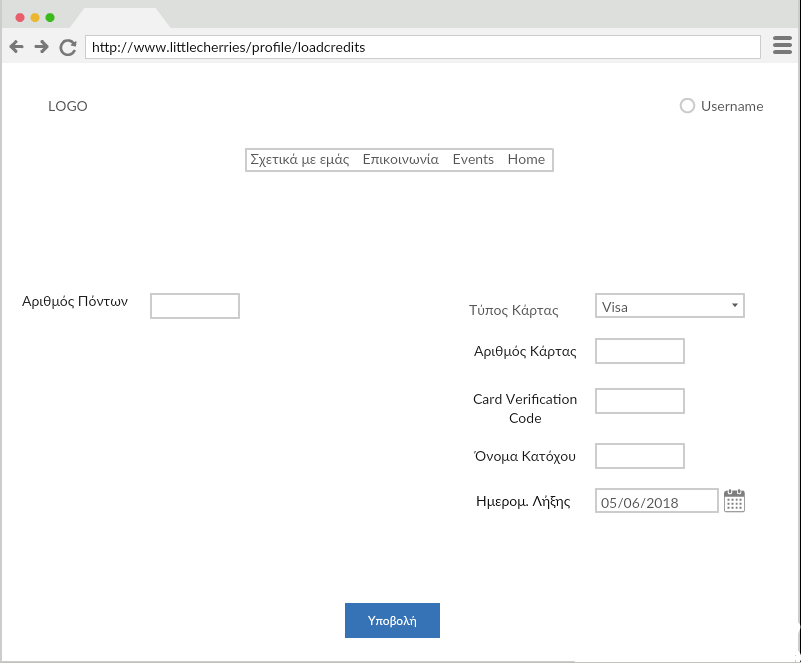

# **Εννιαίο Έγγραφο Ανάλυσης Απαιτήσεων και Τεχνικών Προδιαγραφών**  

## Ομάδα : :cherries: **Little** **Cherries**  :cherries:
## **Little** **Cherries** **Project** 

## **Μέλη** :

Όνοματεπώνυμο  | ΑΜ |  
-------------- | --- | 
*Τελάλη* *Ειρήνη* | 03113009 |
*Ξεζωνάκη* *Δανάη*|  03113065 |  
*Στεφανόπουλος Κοσμάς*|  03113098 | 
*Τασσοπούλου* *Βασιλική*|  03113003  | 
*Στρατή* *Φωτεινή* |  03113001| 

*******

### **Kατάλογος Περιεχομένων**

### 1. Εισαγωγή   
+ 1.1. Σκοπός του εγγράφου
+ 1.2. Δήλωση του πεδίου εφαρμογής
+ 1.3. Επιχειρησιακός Στόχος
    + 1.3.1 Βιωσιμότητα Πλατφόρμας

### 2. Πολιτική Πλατφόρμας
+ 2.1. Κατηγορίες δραστών    
+ 2.2. Ορισμός κλάσεων δραστών 
+ 2.3. Διάγραμμα κλάσεων δραστών
+ 2.4. Επιτρεπτές ενέργειες δραστών
+ 2.5. Παραδοχές

### 3.  Αλληλεπίδραση Συστήματος με Χρήστες
+ 3.1. Περιγραφή σεναρίων χρήσης    
+ 3.2. Ακολουθιακά Διαγράμματα Σεναρίων Χρήσης
+ 3.3. Wireframes

### 4. Αρχιτεκτονική Συστήματος
+ 4.1. Τεχνολογίες
+ 4.2. Εσωτερικά Υποσυστήματα
    + 4.2.1. Serves
    + 4.2.2. Σχεδιασμός Βάσης Δεδομένων
        + 4.2.2.1. Περιγραφή Βάσης
        + 4.2.2.2. E-R Διαγράμματα
    + 4.2.3. Κλάσεις
    + 4.2.4. UML Διαγράμματα Κλάσεων
+ 4.3. Το πρόσθετο Module
+ 4.4. Εξωτερικά Υποσυστήματα

### 5. Ορισμός μη λειτουργικών απαιτήσεων 
+ 5.1. Διαθεσιμότητα - Ανάνηψη από καταστροφές
+ 5.2. Ασφάλεια - Ακεραιότητα
+ 5.3. Ευελιξία - Επεκτασιμότητα
+ 5.4. Απόδοση - Αποκρισιμότητα
+ 5.5. Υποστήριξη διεθνών προτύπων

******

<h> **1. Εισαγωγή** </h> 

<h> **1.1. Σκοπός του Εγγράφου** </h> 

 Στο παρόν έγγραφο παρουσιάζονται και αναλύονται οι Απαιτήσεις Συστήματος και οι Τεχνικές Προδιαγραφές της Διαδικτυακής Πλατφόρμας Little Cherries.Αρχικά, παρουσιάζεται η πολιτική της πλατφόρμας Little Cherries, δηλαδή οι απαιτήσεις που έχουν οριστεί, και στη συνέχεια αναλύεται η αρχιτεκτονική του Συστήματος.

<h> **1.2. Δήλωση του πεδίου Εφαρμογής** </h> 
    
H Ηλεκτρονική Πλατφόρμα Εύρεσης Δραστηριοτήτων (ΕΔ) έχει ως βασική λειτουργία την αγορά εισιτητηρίων για κάποια εκδήλωση από κάποιον γονέα για το παιδί 
    του καθώς και την δημοσίευση εκδήλωσεων από έναν Πάροχο. Το λογισμικό θα χρησιμοποιείται αποκλειστικά από Παρόχους και Γονείς. Η ιστοσελίδα της πλατφόρμας θα είναι
    φυσικά προσβάσιμη και για τους Ανώνυμους Χρήστες χωρίς όμως αυτοί να είναι ικανοί να κάνουν οποιοδήποτε χειρισμό για δημοσίοποίηση εκδήλωσης ή για αγορά 
    εισιτηρίου.
 

<h> **1.3. Eπιχειρησιακός Στόχος** </h> 

Σκοπός της παρούσας επιχείρησης είναι η θεσμοθέτηση μια πλατφόρμας, που θα επιτρέπει στους γονείς να έχουν πρόσβαση σε υπηρεσίες υψηλού επιπέδου, οι οποίες θα συμβάλουν στην πνευματική ολοκλήρωση και σωματική ανάπτυξη των παιδιών που συμμετέχουν σε αυτές.

Παράλληλα, θα εξυπηρετεί στην πιο αποτελεσματική διάθεση των συγκεκριμένων υπηρεσιών από πλευράς των παρόχων, συγκεντρώνοντάς τες κάτω από μια ενιαία δομή, που θα κάνει πιο εύκολες τις διαδικασίες αναζήτησης και επιλογής υπηρεσιών, ενώ παράλληλα θα επιτρέπει την αθροιστική απήχησή της προώθησής τους στο κοινό.

<h> **2. Πολιτική Πλατφόρμας** </h> 

<h> **2.1. Κατηγορίες Δραστών** </h>    
    
 Η πλατφόρμα Εύρεσης Δραστηριοτήτων για Παιδιά (ΕΔ) (Little Cheries) είναι ένα διαδικτυακό σύστημα που αναρτά δραστηριότητες για παιδιά.
Οι χρήστες της πλατφόρμας χωρίζονται σε δύο κατηγορίες. Η πρώτη αναφέρεται στους **Ταυτοποιημένους Χρήστες**. Στην κατηγορία αυτή υπάγονται οι **Διαχειριστές(admin)**, οι **Πάροχοι** και οι **Γονείς**. 
Ως Παρόχους ορίζουμε όλα εκείνα τα φυσικά πρόσωπα ή εταιρίες που διαθέτουν υπηρεσίες προς πώληση. Στη συνέχεια, οι Γονείς αφού εισέλθουν στο σύστημα, επιλέγουν και αγοράζουν τις υπηρεσίες.
Η διαχείριση της πλατφόρμας επιτελείται από τους Διαχειριστές. Αυτοί είναι υπεύθυνοι για το συντονισμό, την επίβλεψη και την ομαλή διεκπεραίωση των αγορών και πληρωμών. 
 

    
 Η δεύτερη κατηγορία αναφέρεται στους **Μη Ταυτοποιημένους Χρήστες**. Περιλαμβάνει δηλαδή όλους τους χρήστες που επιθυμούν να περιηγηθούν ανώνυμα στην πλατφόρμα.
Στη συνέχεια, θα αναλύσουμε πιο λεπτομερώς τη σχέση των χρηστών με το Πληροφοριακό Σύστημα Little Cheries.

<h> **2.2. Ορισμός κλάσεων Δραστών** </h>

 
 Όπως αναφέραμε και παραπάνω, οι χρήστες που αλληλεπιδρούν με το Πληροφοριακό Σύστημα Little Cherries είναι οι εξής:
   
* Ταυτοποιημένοι Χρήστες
    * Γονείς
    * Πάροχοι
    * Διαχειριστές(admin)
    
*  Μη Ταυτοποιημένοι Χρήστες
    * Ανώνυμοι Χρήστες

Ακολουθούν πίνακες με τους Δράστες της πλατφόρμας Little Cherries που αλληλεπιδρούν με το σχεδιαζόμενο λογισμικό   

|     **Όνομα Δράστη**      | **Περιγραφή** | **Τύπος Δράστη** | **Κληρονομεί** |
|-------------------------- |:---------:    |:------------:|-----------:|
| Χρήστης | Όλοι οι δράστες που έχουν πρόσβαση στην πλατφόρμα Little Cherries | Active, Person | Ταυτοποιημένος Χρήστης, Μη Ταυτοποιημένος Χρήστης |
| Ταυτοποιημένος Χρήστης    | Είναι όλοι οι χρήστες που έχουν λογαριασμό στην Πλατφόρμα Little Cherries και μπορούν να αλληλεπιδράσουν με αυτή.  | Active, Person | Γονέας, Πάροχος, Διαχειριστής |
| Γονέας                    | Είναι οι χρήστες που μπορούν να ενημερωθούν για τις δραστηριότητες που διαφημίζονται στην πλατφόρμα Little Cherries, να τις αξιολογήσουν και να προμηθευτούν εισητήρια για αυτές μέσω της πλατφόρμας. | Active, Person | Κανένας |
| Πάροχος                   | Είναι οι διοργανωτές των δρασηριοτήτων που διαφημίζονται στην πλατφόρμα. | Active, Person | Κανένας |
| Διαχειριστής (admin)      | Διαχειρίζεται την πλατφόρμα και είναι υπεύθυνος για την ομαλή αλληλεπίδραση μεταξύ Γονέων και Παρόχων. Έχουμε θεωρήσει ότι στην πλατφόρμα μας θα υπάρχει πάντα ένας βασικός Διαχειριστής, ο οποίος θα μπορεί να εξουσιοδοτήσει και άλλους Διαχειριστές   | Active, Person | Κανένας |
| Μη Ταυτοποιημένος Χρήστης | Είναι όλοι οι χρήστες που δεν έχουν κάποιο λογαριασμό στην Πλατφόρμα Little Cherries | Passive, Person | Ανώνυμος Χρήστης |
| Ανώνυμος Χρήστης          | Έχουν τη δυνατότητα να περιηγηθούν ανώνυμα στην πλατφόρμα και να ενημερωθούν για τις εκδηλώσεις που διαφημίζονται. Δεν μπορούν να αλληλεπιδράσουν περεταίρω με το Σύστημα. Για να είναι αυτό εφικτό θα πρέπει να δημιουργήσουν λογαριασμό | Passive, Person | Κανένας |

<h> **2.3. Διάγραμμα κλάσεων Δραστών** </h>

 

<h> **2.4. Επιτρεπτές ενέργειες Δραστών** </h>
<h> **2.5. Παραδοχές** </h>

<h> **3. Αλληλεπίδραση Συστήματος με Χρήστες** </h>

<h>**3.3. Wireframes**</h>

Στη συνέχεια, παρατίθενται τα Wireframes μέσω των οποίων αλληλεπιδρούν οι Χρήστες με την πλατφόρμα Little Cherries.

<h>**Home**</h>

 

<h>**About Us**</h>

 

<h>**Contact Us**</h>

 

<h>**Events**</h>

 

<h>**Single Event Page**</h>

 

<h>**Registration**</h>

 

<h>**Add an Admin**</h>

 

<h>**Admin Login**</h>

 

<h>**Admin Profile**</h>

 

<h>**Admin Views Events**</h>

 

<h>**Admin Views Admins**</h>

 

<h>**Company Registration**</h>

 

<h>**Company Profile**</h>

 

<h>**Company Profile Edit**</h>

 

<h>**Company's Events**</h>

 

<h>**Event Creation**</h>

 

<h>**Company Views Events' Statistics**</h>

 

<h>**Parent Registration**</h>

 

<h>**Parent Profile**</h>

 

<h>**Parent Profile Edit**</h>

 

<h>**Search Events**</h>

 

<h>**Parent Loads Credits**</h>

 

<h>**Reservation**</h>

 

<h>**After Reservation Failure**</h>

 

<h>**After Reservation Success**</h>

 

##  5. Ορισμός μη λειτουργικών απαιτήσεων

<h> **5.1. Διαθεσιμότητα - Ανάνηψη από καταστροφές** </h>
    
 H διαθεσιμότητα του συστήματος μπορεί να διασφαλιστεί με τακτικό backup της βάσης, σε συνδυασμό με τη δημιουργία δομών για redeployment, σε περίπτωση απροόπτου. 
        Επίσης, καλή πρακτική είναι η χρήση standby spare servers(ιδανικά σε cloud), που θα εξασφαλίσουν τη διαθεσιμότητα των υπηρεσιών μας κατά το recovery phase.
    

    
<h> **5.2. Ασφάλεια - Ακεραιότητα** </h>
    
 Η ασφάλεια των παρεχόμενων υπηρεσιών επιτυγχάνεται χάρη στην ταυτοποίηση των χρηστών, προκειμένου να εκτελέσουν τις διάφορες λειτουργίες, καθώς και με τη δυνατότητα του admin να μειώνει δικαιώματα ή να μπλοκάρει λογαριασμούς όταν αυτοί παραβιάζουν την πολιτική ορθής χρήσης της πλατφόρμας.
        Επίσης, η χρήση του πρωτοκόλλου HTTPS για όλες τις σελίδες διασφαλίζει την ακεραιότητα της υπηρεσίας από εξωτερικές κακόβουλες επιθέσεις.
    

    
<h> **5.3. Ευελιξία - Επεκτασιμότητα** </h>
    
 Η πλατφόρμα παρέχει την απαραίτητη ευελιξία κατά τη χρήση της, καθώς είναι screen responsive και μπορεί να χρησιμοποιηθεί με τον ίδιο τρόπο από Desktop, Tablet ή Mobile συσκευές.
        Επίσης, υπάρχει η δυνατότητα επέκτασης της λειτουργικότητας του συστήματος σε μελλοντικές εκδόσεις, με την προσθήκη χαρακτηριστικών όπως Σύγκριση Υπηρεσιών, Επι πληρωμή διαφήμιση παρόχων ή Εκπτωτικές τιμές για μαζική αγορά εισιτηρίων.
    

    
<h> **5.4. Απόδοση - Αποκρισιμότητα** </h>
    
 Είναι σημαντικό το σύστημα να είναι άμεσα αποκρίσιμο, προκειμένου να διασφαλιστεί το καλό user experience του χρήση.
        Επιπλέον έμφαση θα πρέπει να δοθεί σε ορισμένες λειτουργίες, όπως το atomicity των κρατήσεων εισιτηρίων ή οι τραπεζικές συναλλαγές.
        Παρ' όλα αυτά, καθώς δεν πρόκειται για ένα σύστημα πραγματικού χρόνου (π.χ. ιατρικές εφαρμογές) είναι ανεκτή η εισαγωγή κάποιας καθυστέρησης στην απόκρισή του, ειδικά σε λειτουργίες που με μεγάλες απαιτήσεις σε επεξεργαστική ισχύ, όπως είναι το uploading και η επεξεργασία των φωτογραφιών.
    

    
<h> **5.5. Υποστήριξη διεθνών προτύπων** </h>
    
 Το σύστημα θα πρέπει να συμμορφώνεται με τα διεθνή πρότυπα, ειδικά σε ότι αφορά την αλληλεπίδρασή του με άλλα, ήδη υπάρχοντα, συστήματα, όπως η υπηρεσία χαρτών και τα banking transactions.
        Επίσης, το deployment του θα γίνεται με τη χρήση ευρέως διαδεδομένων εργαλείων λογισμικού, ενώ είναι χρήσιμο η βάση να υποστηρίζει μαζική εισαγωγή - εξαγωγή δεδομένων, σε κάποιο international format, όπως το .csv.
    

    
