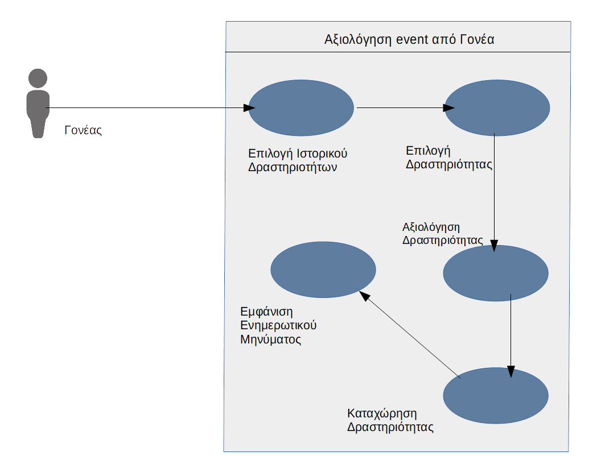
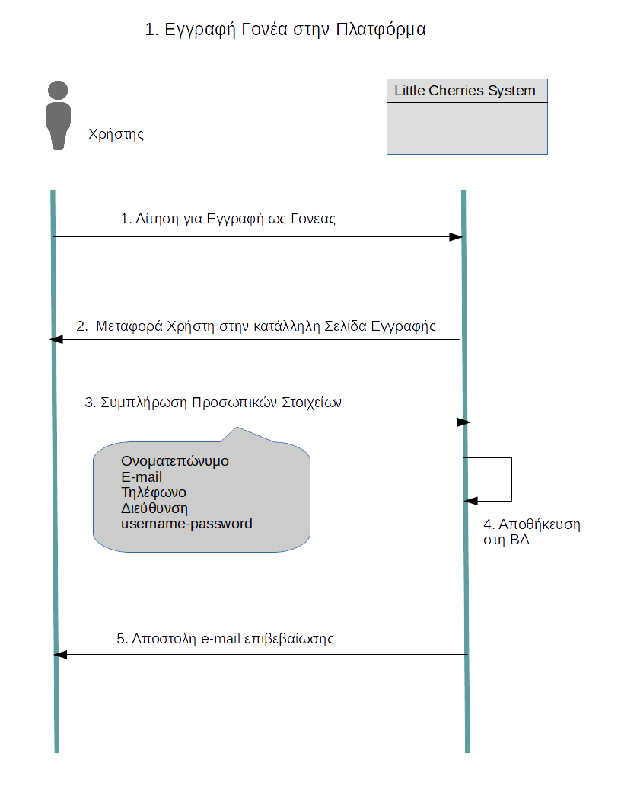

# **Εννιαίο Έγγραφο Ανάλυσης Απαιτήσεων και Τεχνικών Προδιαγραφών**  

## Ομάδα : :cherries: **Little** **Cherries**  :cherries:
## **Little** **Cherries** **Project** 

## **Μέλη** :

Όνοματεπώνυμο  | ΑΜ |  
-------------- | --- | 
*Τελάλη* *Ειρήνη* | 03113009 |
*Ξεζωνάκη* *Δανάη*|  03113065 |  
*Στεφανόπουλος Κοσμάς*|  03113098 | 
*Τασσοπούλου* *Βασιλική*|  03113003  | 
*Στρατή* *Φωτεινή* |  03113001| 

*******

### **Kατάλογος Περιεχομένων**

### 1. Εισαγωγή   
+ 1.1. Σκοπός του εγγράφου
+ 1.2. Δήλωση του πεδίου εφαρμογής
+ 1.3. Επιχειρησιακός Στόχος
    + 1.3.1 Βιωσιμότητα Πλατφόρμας

### 2. Πολιτική Πλατφόρμας
+ 2.1. Κατηγορίες δραστών    
+ 2.2. Ορισμός κλάσεων δραστών 
+ 2.3. Διάγραμμα κλάσεων δραστών
+ 2.4. Επιτρεπτές ενέργειες δραστών
+ 2.5. Πολιτική Εισητηρίων και Ηλεκτρονικό Πορτοφόλι
+ 2.6. Παραδοχές

### 3.  Αλληλεπίδραση Συστήματος με Χρήστες
+ 3.1. Δυναμική συμπεριφορά συστήματος
    + 3.1.1. Περιγραφή σεναρίων χρήσης    
    + 3.1.2. Διαγράμματα σεναρίων χρήσης
    + 3.1.3. Διαγράμματα δραστηριότητας
    + 3.1.4. Διαγράμματα μηχανών κατάστασης
    + 3.1.5. Ακολουθιακά Διαγράμματα Σεναρίων Χρήσης
+ 3.2. Wireframes

### 4. Αρχιτεκτονική Συστήματος
+ 4.1. Τεχνολογίες
+ 4.2. Εσωτερικά Υποσυστήματα
    + 4.2.1. Serves
    + 4.2.2. Σχεδιασμός Βάσης Δεδομένων
        + 4.2.2.1. Περιγραφή Βάσης
        + 4.2.2.2. E-R Διαγράμματα
    + 4.2.3. Κλάσεις
    + 4.2.4. UML Διαγράμματα Κλάσεων
+ 4.3. Το πρόσθετο Module
+ 4.4. Εξωτερικά Υποσυστήματα

### 5. Ορισμός μη λειτουργικών απαιτήσεων 
+ 5.1. Διαθεσιμότητα - Ανάνηψη από καταστροφές
+ 5.2. Ασφάλεια - Ακεραιότητα
+ 5.3. Ευελιξία - Επεκτασιμότητα
+ 5.4. Απόδοση - Αποκρισιμότητα
+ 5.5. Υποστήριξη διεθνών προτύπων

******

<h> **1. Εισαγωγή** </h> 

<h> **1.1. Σκοπός του Εγγράφου** </h> 

 Στο παρόν έγγραφο παρουσιάζονται και αναλύονται οι Απαιτήσεις Συστήματος και οι Τεχνικές Προδιαγραφές της Διαδικτυακής Πλατφόρμας Little Cherries. Αρχικά, παρουσιάζεται η πολιτική της πλατφόρμας Little Cherries, δηλαδή οι απαιτήσεις που έχουν οριστεί, και στη συνέχεια αναλύεται η αρχιτεκτονική του Συστήματος.

<h> **1.2. Δήλωση του πεδίου Εφαρμογής** </h> 
    
H Ηλεκτρονική Πλατφόρμα Εύρεσης Δραστηριοτήτων (ΕΔ) έχει ως βασική λειτουργία την αγορά εισιτηρίων για κάποια εκδήλωση από κάποιον γονέα για το παιδί 
    του καθώς και την δημοσίευση εκδήλωσεων από έναν Πάροχο. Το λογισμικό θα χρησιμοποιείται αποκλειστικά από Παρόχους και Γονείς. Η ιστοσελίδα της πλατφόρμας θα είναι
    φυσικά προσβάσιμη και από τους Ανώνυμους Χρήστες, χωρίς όμως αυτοί να είναι ικανοί να κάνουν οποιοδήποτε χειρισμό για δημοσίοποίηση εκδήλωσης ή για αγορά 
    εισιτηρίου.
 

<h> **1.3. Eπιχειρησιακός Στόχος** </h> 

Σκοπός της παρούσας επιχείρησης είναι η θεσμοθέτηση μια πλατφόρμας, που θα επιτρέπει στους γονείς να έχουν πρόσβαση σε υπηρεσίες υψηλού επιπέδου, οι οποίες θα συμβάλουν στην πνευματική ολοκλήρωση και σωματική ανάπτυξη των παιδιών που συμμετέχουν σε αυτές.

Παράλληλα, θα εξυπηρετεί στην πιο αποτελεσματική διάθεση των συγκεκριμένων υπηρεσιών από πλευράς των παρόχων, συγκεντρώνοντάς τες κάτω από μια ενιαία δομή, που θα κάνει πιο εύκολες τις διαδικασίες αναζήτησης και επιλογής υπηρεσιών, ενώ παράλληλα θα επιτρέπει την αθροιστική απήχησή της προώθησής τους στο κοινό.

Τέλος, για να εξασφαλιστεί η βιωσιμότητα της επιχείρησης είναι απαραίτητη η ύπαρξη μιας μορφής κέρδους, η οποία θα εξασφαλίζεται με την ύπαρξη μερίσματος επί των τιμών των παρεχόμενων υπηρεσιών, με αποδέκτες τους διαχειριστές της σελίδας. Το κέρδος των διαχειριστών της πλατφόρμας προκύπτει από την προμήθεια που λαμβάνουν, κατά την πραγματοποίηση αγορών μέσω αυτής. Πιο συγκεκριμένα, οι υπηρεσίες που εισαγει ο πάροχος προς αγορά υποτιμολογούνται και η διαφορά στην τιμή -η οποία παρουσιάζεται αμετάβλητη στον πελάτη- αποτελεί το κέρδος των διαχειριστών. Η δημοτικότητα ανάμεσα στους παρόχους εξασφαλίζεται χάρη στην απήχηση της πλατφόρμας στο κοινό, που έχει ως αποτέλεσμα αυξημένες πωλήσεις εισιτηρίων και κατά συνέπεια μεγαλύτερο κέρδος απ' αυτό που θα λάμβανε ο πάροχος αν διέθετε τις υπηρεσίες βασιζόμενος στις δικές του δυνατότητες.

<h> **2. Πολιτική Πλατφόρμας** </h> 

<h> **2.1. Κατηγορίες Δραστών** </h>    
    
 Η πλατφόρμα Εύρεσης Δραστηριοτήτων για Παιδιά (ΕΔ) (Little Cheries) είναι ένα διαδικτυακό σύστημα που αναρτά δραστηριότητες για παιδιά.
Οι χρήστες της πλατφόρμας χωρίζονται σε δύο κατηγορίες. Η πρώτη αναφέρεται στους **Ταυτοποιημένους Χρήστες**. Στην κατηγορία αυτή υπάγονται οι **Διαχειριστές(admin)**, οι **Πάροχοι** και οι **Γονείς**. 
Ως Παρόχους ορίζουμε όλα εκείνα τα φυσικά πρόσωπα ή εταιρίες που διαθέτουν υπηρεσίες προς πώληση. Στη συνέχεια, οι Γονείς αφού εισέλθουν στο σύστημα, επιλέγουν και αγοράζουν τις υπηρεσίες.
Η διαχείριση της πλατφόρμας επιτελείται από τους Διαχειριστές. Αυτοί είναι υπεύθυνοι για το συντονισμό, την επίβλεψη και την ομαλή διεκπεραίωση των αγορών και πληρωμών. 
 

    
 Η δεύτερη κατηγορία αναφέρεται στους **Μη Ταυτοποιημένους Χρήστες**. Περιλαμβάνει δηλαδή όλους τους χρήστες που επιθυμούν να περιηγηθούν ανώνυμα στην πλατφόρμα.
Στη συνέχεια, θα αναλύσουμε πιο λεπτομερώς τη σχέση των χρηστών με το Πληροφοριακό Σύστημα Little Cheries.

<h> **2.2. Ορισμός κλάσεων Δραστών** </h>

 
 Όπως αναφέραμε και παραπάνω, οι χρήστες που αλληλεπιδρούν με το Πληροφοριακό Σύστημα Little Cherries είναι οι εξής:
   
* Ταυτοποιημένοι Χρήστες
    * Γονείς
    * Πάροχοι
    * Διαχειριστές(admin)
    
*  Μη Ταυτοποιημένοι Χρήστες
    * Ανώνυμοι Χρήστες

Ακολουθούν πίνακες με τους Δράστες της πλατφόρμας Little Cherries που αλληλεπιδρούν με το σχεδιαζόμενο λογισμικό   

|     **Όνομα Δράστη**      | **Περιγραφή** | **Τύπος Δράστη** | **Κληρονομεί** |
|-------------------------- |:---------:    |:------------:|-----------:|
| Χρήστης | Όλοι οι δράστες που έχουν πρόσβαση στην πλατφόρμα Little Cherries | Active, Person | Ταυτοποιημένος Χρήστης, Μη Ταυτοποιημένος Χρήστης |
| Ταυτοποιημένος Χρήστης    | Είναι όλοι οι χρήστες που έχουν λογαριασμό στην Πλατφόρμα Little Cherries και μπορούν να αλληλεπιδράσουν με αυτή.  | Active, Person | Γονέας, Πάροχος, Διαχειριστής |
| Γονέας                    | Είναι οι χρήστες που μπορούν να ενημερωθούν για τις δραστηριότητες που διαφημίζονται στην πλατφόρμα Little Cherries, να τις αξιολογήσουν και να προμηθευτούν εισητήρια για αυτές μέσω της πλατφόρμας. | Active, Person | Κανένας |
| Πάροχος                   | Είναι οι διοργανωτές των δρασηριοτήτων που διαφημίζονται στην πλατφόρμα. | Active, Person | Κανένας |
| Διαχειριστής (admin)      | Διαχειρίζεται την πλατφόρμα και είναι υπεύθυνος για την ομαλή αλληλεπίδραση μεταξύ Γονέων και Παρόχων. Έχουμε θεωρήσει ότι στην πλατφόρμα μας θα υπάρχει πάντα ένας βασικός Διαχειριστής, ο οποίος θα μπορεί να εξουσιοδοτήσει και άλλους Διαχειριστές   | Active, Person | Κανένας |
| Μη Ταυτοποιημένος Χρήστης | Είναι όλοι οι χρήστες που δεν έχουν κάποιο λογαριασμό στην Πλατφόρμα Little Cherries | Passive, Person | Ανώνυμος Χρήστης |
| Ανώνυμος Χρήστης          | Έχουν τη δυνατότητα να περιηγηθούν ανώνυμα στην πλατφόρμα και να ενημερωθούν για τις εκδηλώσεις που διαφημίζονται. Δεν μπορούν να αλληλεπιδράσουν περεταίρω με το Σύστημα. Για να είναι αυτό εφικτό θα πρέπει να δημιουργήσουν λογαριασμό | Passive, Person | Κανένας |

<h> **2.3. Διάγραμμα κλάσεων Δραστών** </h>

 

<h> **2.4. Επιτρεπτές ενέργειες Δραστών** </h>

Στο παρόν κεφάλαιο θα περιγράψουμε τα δικαιώματα της κάθε κατηγορίας Χρηστών της πλατφόρμας Little Cherries, που αποτελούν ουσιαστικά τις Απαιτήσεις του Συστήματος. Με βάση αυτές τις απαιτήσεις, ορίσαμε τις Τεχνικές Προδιαγραφές που αναλύονται στα επόμενα κεφάλαια.

<h>**2.4.1. Ανώνυμοι Χρήστες**</h>

Όπως αναφέρθηκε και παραπάνω, οι επιτρεπτές ενέργειες των Ανώνυμων Χρηστών της Πλατφόρμας είναι περιορισμένες. Πιο συγκεκριμένα οι Ανώνυμοι χρήστες μπορούν:

* Να περιηγηθούν στην πλατφόρμα και να ενημερωθούν για τα events που διαφημίζονται.
* Να πληροφορηθούν λεπτομερώς για κάποιο event(Περιγραφή,Τοποθεσία,Διαθέσιμα Εισητήρια,Αξιολόγηση από άλλους Χρήστες).
* Να αναζητήσουν events με βάση χαρακτηριστικά όπως: κατηγορία event, target group, περιοχή.
* Να δημιουργήσουν λογαριασμό στην πλατφόρμα είτε ως Γονείς είτε ως Πάροχοι.

<h>**2.4.2. Γονείς**</h>

Οι Ταυτοποιημένοι Χρήστες της Πλατφόρμας που συνδέονται μέσω λογαριασμού Γονέα έχουν τα εξής δικαιώματα:

* Να επεξεργαστούν το προφίλ τους(Ε-Μail,Διεύθυνση,Τηλέφωνο).
* Να αλλάξουν τον κωδικό με τον οποίο συνδέονται στο λογαριασμό τους.
* Να περιηγηθούν στην πλατφόρμα και να ενημερωθούν για τα events που διαφημίζονται.
* Να πληροφορηθούν λεπτομερώς για κάποιο event(Περιγραφή,Τοποθεσία,Διαθέσιμα Εισητήρια,Αξιολόγηση από άλλους Χρήστες).
* Να αναζητήσουν events με βάση χαρακτηριστικά όπως: κατηγορία event, target group, περιοχή.
* Να δημιουργήσουν ένα ηλεκτρονικό πορτοφόλι και να το φορτίσουν με πόντους.
* Να προμηθευτούν εισητήρια για ένα event, εάν βέβαια το υπόλοιπο των πόντων τους επαρκεί.
* Να προσθέσουν ένα Event στο "καλάθι" τους. Με τον τρόπο αυτό αποθηκεύουν το event ώστε να μπορούν να μεταβούν άμεσα στη σελίδα του event όταν επιθυμούν, και αν θέλουν να το αποθηκεύσουν ως Αγαπημένο.
* Να αξιολογήσουν ένα event για το οποίο έχουν αγοράσει εισητήριο. 

<h>**2.4.3. Πάροχοι**</h>

Οι Πάροχοι, δηλαδή οι εταιρείες που διαφημίζουν τα events τους στην πλατφόρμα Little Cherries έχουν τις εξής δυνατότητες:

* Να επεξεργαστούν το προφίλ τους(Ε-Μail,Διεύθυνση,Τηλέφωνο,Ονοματεπώνυμο Υπεύθυνου).
* Να αλλάξουν τον κωδικό με τον οποίο συνδέονται στο λογαριασμό τους.
* Να ενημερωθούν για τα events που διαφημίζονται στην Πλατφόρμα.
* Να πληροφορηθούν λεπτομερώς για κάποιο event(Περιγραφή,Τοποθεσία,Διαθέσιμα Εισητήρια,Αξιολόγηση από άλλους Χρήστες).
* Να αναζητήσουν events με βάση χαρακτηριστικά όπως: κατηγορία event, target group, περιοχή.
* Να δημιουργήσουν μια νέα δραστηριότητα η οποία θα διαφημίζεται στην πλατφόρμα.
* Να δουν το Ιστορικό των Events τους και Μηνιαία reports με Στατιστικά Στοιχεία για αυτά.
* Να πληροφορηθούν για το πλήθος των πόντων που έχουν στην κατοχή τους. 

<h>**2.4.4. Admins**</h>

Οι Διαχειριστές της Πλατφόρμας Little Cherries έχουν τα εξής δικαιώματα:

* Να αλλάξουν τον κωδικό με τον οποίο συνδέονται στο λογαριασμό τους.
* Να προσθέσουν κάποιον άλλο Διαχειριστή.
* Να ενημερωθούν πλήρως για τα events(Περιγραφή,Τοποθεσία,Διαθέσιμα Εισητήρια,Αξιολόγηση) που διαφημίζονται στην Πλατφόρμα.
* Να αναζητήσουν events με βάση χαρακτηριστικά όπως: κατηγορία event, target group, περιοχή.
* Να κλειδώσουν το προφίλ κάποιου Γονέα ή Παρόχου.
* Να ανακαλέσουν κάποιο από τα δικαιώματα για έναν Γονέα ή έναν Πάροχο.

<h> **2.5. Πολιτική Εισητηρίων και Ηλεκτρονικό Πορτοφόλι** </h>

Σε αυτό το σημείο καλό θα ήταν να εξηγήσουμε λίγο παραπάνω την Πολιτική Εισητηρίων της Πλατφόρμας. Ο πάροχος κατά την προσθήκη μιας υπηρεσίας θα ορίζει και τον αντίστοιχο αριθμό εισιτηρίων γι' αυτήν. Ο αριθμός αυτός θα μπορεί να μεταβληθεί στο μέλλον, κατά βούληση του παρόχου. Κάθε γονέας θα μπορεί να αγοράζει τον επιθυμητό αριθμό εισιτηρίων για κάθε υπηρεσία μέσω της αντίστοιχης σελίδας. Δεν προβλέπεται κάποιου είδους έκπτωση για μαζική αγορά είσιτηρίων. Τέλος, με την ολοκλήρωση της αγορά θα αποστέλεται ενημερωτικό email στον γονέα, με πληροφορίες για την αγορά και τα είσιτήρια. Ο κάθε γονέας θα έχει τη δυνατότητα να "φορτίσει" το ηλεκτρονικό του πορτοφόλι με έναν αριθμό πόντων πληρώνοντας το αντίστοιχο αντίτιμο. Τα χρήματα τότε θα αφαιρούνται από τον λογαριασμό του και θα μεταφέρονται στον λογαριασμό που διατηρεί ο admin της πλατφόρμας. Κατά την πραγματοποίηση κάποιας αγοράς, οι πόντοι αφαιρούνται από το πορτοφόλι του γονέα και ένα μέρος αυτών μεταφέρεται στο προτοφόλι του παρόχου. Όταν ο πάροχος το αποφασίσει, μπορεί να προβεί σε εξαργύρωση πόντων, κατά την οποία το χρηματικό ποσό που αντιστοιχεί σ' αυτούς μεταφέρεται στον λογαριασμό του από τον λογαριασμό του admin.

<h> **2.6. Παραδοχές** </h>

  
 Κατά την ανάλυση των απαιτήσεων, και μελετώντας τις ανάγκες του συστήματός μας καταλήξαμε στις εξής παραδοχές για τους Δράστες που θα αλληλεπιδρούν με την πλατφόρμα Little Cherries:
 

1. Όπως αναφέραμε και παραπάνω, κατά τη δημιουργία της πλατφόρμας ορίζεται ένας αρχικός admin, ο οποίος μπορεί στη συνέχεια να ορίσει και άλλους admins.
2. Όλοι οι ταυτοποιημένοι χρήστες έχουν έγκυρη διεύθυνση e-mail.
3. Οι Γονείς και οι Πάροχοι έχουν έγκυρο τραπεζικο λογαριασμο.
4. Δεδομένης της απαίτησης για την ύπαρξη ηλεκτρονικού πορτοφολιού, μέσω του οποίου θα γίνεται εξαργύρωση πόντων από τους Γονείς, υποθέτουμε ότι όταν ένας Γονέας προβεί στην αγορά x πόντων, το χρηματικό υπόλοιπο στην κάρτα του θα επαρκεί για αυτή την αγορά.
5. Το Σύστημά μας δεν κάνει έλεγχο για την εγκυρότητα των εκδηλώσεων, θεωρούμε δηλαδή ότι όλες οι δραστηριότητες που διαφημίζονται στην πλατφόρμα Little Cherries είναι έγκυρες και θα πραγματοποιηθούν όπως έχουν οριστεί.
6. Δεν είναι δυνατόν ένας Γονέας να ακυρώσει ένα εισητήριο και να πιστωθούν ξανά στο ηλεκτρονικό πορτοφόλι του οι αντίστοιχοι πόντοι.
7. Ένας Πάροχος δεν μπορεί να επεξεργαστεί ή να διαγράψει ένα event.

<h> **3. Αλληλεπίδραση Συστήματος με Χρήστες** </h>

<h> **3.1. Δυναμική συμπεριφορά συστήματος** </h>

<h> **3.1.1. Περιγραφή σεναρίων χρήσης** </h>

 
 Στην παρούσα ενότητα παρουσιάζουμε τα Σενάρια Χρήσης (Use Cases) που καταγράψαμε κατά την συλλογή των απαιτήσεων. Τα Σενάρια Χρήσης που αναλύονται παρακάτω περιγράφουν την αλληλεπίδραση των Δραστών με την πλατφόρμα Little Cherries

<h>**1. Εγγραφή Γονέα στην Πλατφόρμα** </h>
    
**Σκοπός** του παρόντος Σεναρίου Χρήσης είναι να εγγραφεί ένας Δράστης στην πλατφόρμα Little Cherries αποκτώντας ρόλο Γονέα.   
        **Αποτέλεσμα** του Σεναρίου είναι να προστεθούν στη Βάση Δεδομένων του Συστήματος τα στοιχεία του Γονέα, ώστε να είναι δυνατόν να αλληλεπιδράσει με την πλατφόρμα όπως δηλώνεται κατά των ορισμό των Χρηστών.
        Οι **Δράστες** που συμμετέχουν στο παρόν Σενάριο είναι Χρήστες της πλατφόρμας, οι οποίοι επιθυμούν να εγγραφούν στην πλατφόρμα Little Cherries αποκτώντας ρόλο Γονέα.
        
**Περιγραφή Σεναρίου:**
        
1. Ο Χρήστης που επιθυμεί να εγγραφεί ως Γονέας, επιλέγει τη λειτουργία της Εγγραφής ως Γονέας και μεταφέρεται στην αντίστοιχη σελίδα, όπου υπάρχει η κατάλλληλη φόρμα εγγραφής. .
2. Στη φόρμα αυτή ο ενδιαφερόμενος πρέπει να συμπληρώσει το Ονοματεπώνυμό του, τη διέυθυνση e-mail του, ένα τηλέφωνο επικοινωνίας, τη διεύθυνση κατοικίας του και username, password της επιλογης του.
3. Τα στοιχεία του Χρήστη προστίθενται στη Βάση και αποστέλλεται e-mail επιβεβαίωσης από την πλατφόρμα στο νέο εγγεγραμμένο πλέον Γονέα.

<h>**2. Εγγραφή Παρόχου στην Πλατφόρμα** </h>
    
**Σκοπός** του δεύτερου Σεναρίου Χρήσης είναι να εγγραφεί στην πλατφόρμα Little Cherries μια Επιχείρηση η οποία διοργανώνει παιδικές δραστηριότητες. 
    **Αποτέλεσμα** του Σεναρίου είναι να προστεθούν στη Βάση Δεδομένων του Συστήματος, τα στοιχεία της Επιχείρησης και να δημιουργηθεί ο αντίστοιχος Λογαριασμός Παρόχου.
    Ως **Δράστη** του Σεναρίου θεωρούμε κάποιον Υπέυθυνο Επικοινωνίας της Επιχείρησης, ο οποίος μετά το τέλος του Σεναρίου θα θεωρείται από το Σύστημά μας  ως ο αντίστοιχος Πάροχος για τη συγκεκριμένη επιχείρηση.
    
**Περιγραφή Σεναρίου:**
    
1. Ο εκπρόσωπος της Επιχείρησης, επιλέγει τη λειτουργία της Εγγραφής ως Επιχείρηση και μεταφέρεται στην αντίστοιχη σελίδα, όπου υπάρχει η κατάλληλη φόρμα εγγραφής.
2. Στη φόρμα αυτή θα πρέπει να συμπληρωθούν η Επωνυμία, η διεύθυνση και το ΑΦΜ της Επιχείρησης, το Ονοματεπώνυμο, το τηλέφωνο, το e-mail του Υπεύθυνου Επικοινωνίας, καθώς και ένας αριθμός τραπεζικού λογαριασμού για τις χρηματικές συναλλαγές που θα γίνουν.
3. Επίσης, θα πρέπει να δημιουργηθεί ένα e-wallet(αρχικά άδειο) που θα περιέχει κάθε χρονική στιγμή τους πόντους του συγκεκριμένου Παρόχου.
4. Τα στοιχεία αυτά προστίθενται στη Βάση και αποστέλλεται e-mail επιβεβαίωσης στον Υπεύθυνο Επικοινωνίας. 

<h>**3. Προσθήκη admin**</h>
    
**Σκοπός** αυτού του Σεναρίου Χρήσης είναι να προστεθεί από κάποιον Διαχειριστή της πλατφόρμας, ένας Ταυτοποιημένος Χρήστης ο οποίος θα έχει και αυτός ρόλο admin, και άρα σαν **αποτέλεσμα** θα έχει τις αρμοδιότητες και τα δικαιώματα ενός Διαχειριστή.
    Ως **Δράστη** του Σεναρίου θεωρούμε κάποιον από τους admins της πλατφόρμας και συνεπώς απαραίτητη **Προϋπόθεση** είναι να έχει εισέλθει ένας από τους τρέχοντες Διαχειριστές στον λογαριασμό του χρησιμοποιώντας έγκυρα διαπιστευτήρια.    

**Περιγραφή Σεναρίου:**

1. Ο Διαχειριστής που θα πραγματοποιήσει την εγγραφή επιλέγει τη λειτουργία της Προσθήκης νέου Admin και μεταφέρεται στην αντίστοιχη σελίδα, όπου υπάρχει η κατάλληλη φόρμα.
2. Στη φόρμα αυτή θα πρέπει να συμπληρωθούν το Ονοματεπώνυμο, η διέυθυνση και το e-mail του νέου admin.
3. Έπειτα, ο μελλοντικός admin επιλέγει username και password για το λογαριασμό.
4. Τα παραπάνω στοιχεία αποθηκεύονται στη Βάση και αποστέλλεται e-mail επιβεβαίωσης στο νέο admin.

    
<h>**4. Δημιουργία e-wallet από Γονέα και φόρτιση με πόντους**</h>
    
 **Σκοπός** του παρόντος Σεναρίου Χρήσης είναι η δημιουργία ενός e-wallet το οποίο θα ανήκει στον ενδιαφερόμενο Χρήστη-Γονέα και η φόρτισή του με πόντους. 
    **Αποτέλεσμα** του Σεναρίου είναι να έχει ο συγκεκριμένος Χρήστης-Γονέας στη διάθεσή του ένα σύνολο πόντων, τους οποίους "αποθηκεύει" στο e-wallet που έφτιαξε και μπορεί να τους εξαργυρώσει μέσω της αγοράς εισητηρίων. 
    **Δράστες** του παρόντος Σεναρίου είναι οι Ταυτοποιημένοι Χρήστες της πλατφόρμας που έχουν το ρόλο του Γονέα και απαραίτητη **Προϋπόθεση** για τη λειτουργία του συγκεκριμένου Σεναρίου είναι να έχει εισέλθει ο Γονέας στο λογαριασμό που διατηρεί στην πλατφόρμα Little Cherries.

**Περιγραφή Σεναρίου:**

1. Ο Χρήστης-Γονέας, επιλέγει τη λειτουργία της δημιουργίας νέου e-wallet.
2. Δημιουργείται το ζητούμενο ηλεκτρονικό πορτοφόλι και ο Χρήστης έχει τη δυνατότητα να αγοράσει πόντους.
3. Επιλέγοντας τους πόντους που θέλει να αγοράσει και αυτοί οι πόντοι προστίθενται στο προσωπικό του e-wallet, και αφαιρείται από τον τραπεζικό λογαριασμό που έχει ορίσει ο Γονέας για αυτή τη συναλλαγή, το αντίστοιχο χρηματικό ποσό.
4. Τα χρήματα που αφαιρούνται από τον τραπεζικό λογαριασμό του Γονέα, μεταφέρονται στον τραπεζικό λογαριασμό των Διαχειριστών της πλατφόρμας.

<h>**5. Εξαργύρωση πόντων από Πάροχο**</h>
    
**Σκοπός** αυτού του Σεναρίου Χρήσης είναι η Εξαργύρωση, από έναν Πάροχο, πόντων που υπάρχουν στο ηλεκτρονικό πορτοφόλι που διατηρεί στην πλατφόρμα Little Cherries. Όπως αναφέρουμε και πιο αναλυτικά στην ενότητα 6, γίνεται μεταφορά χρημάτων από το τραπεζικό λογαριασμό των admin, στο τραπεζικό λογαριασμό του Παρόχου.
    Επομένως, **αποτέλεσμα** του Σεναρίου θα είναι να μειωθούν κατά ένα ποσό οι πόντοι στο ηλεκτρονικό πορτοφόλι του Παρόχου, καθώς και να μεταφερθεί το αντίστοιχο χρηματικό ποσό από τους admins στον Πάροχο. 
    **Δράστης** του Σεναρίου είναι ο Πάροχος που εμπλέκεται στη συναλλαγή και απαραίτητη **Προϋπόθεση** είναι να έχει εισέλθει στο λογαριασμό που διατηρεί στην πλατφόρμα Little Cherries, χρησιμοποιώντας τα κατάλληλα διαπιστευτήρια.

**Περιγραφή Σεναρίου:**

1. Ο Πάροχος επιλέγει τη λειτουργία της εξαργύρωσης πόντων.
2. Επιλέγει τους πόντους που θέλει να εξαργυρώσει, οι οποίοι θα πρέπει να είναι λιγότεροι ή ίσοι από το σύνολο των πόντων που περιέχονται στο ηλεκτρονικό του πορτοφόλι.
3. Εάν ισχύει το παραπάνω, το Σύστημα μειώνει το περιεχόμενο του ηλεκτρονικού πορτοφολιού του Παρόχου και δίνει την κατάλληλη εντολή στην Τράπεζα για μεταφορά χρημάτων από τον λογαριασμό των admin σε αυτόν του Παρόχου.

<h>**6. Επεξεργασία Προφίλ Γονέα/Παρόχου**</h>
    
**Σκοπός** του έκτου Σεναρίου Χρήσης είναι η επεξεργασία του προφίλ ενός Γονέα ή ενός Παρόχου, από τον ίδιο. Οι δύο αυτές περιπτώσεις παρουσιάζουν αρκετές ομοιότητες για αυτό και θα τις αναλύσουμε μαζί. 
    **Αποτέλεσμα** του Σεναρίου θα είναι η αλλαγή των στοιχείων που υπάρχουν στη Βάση Δεδομένων του Συστήματος, για το συγκεκριμένο Χρήστη.
    **Δράστης** του Σεναρίου είναι φυσικά ο ενδιαφερόμενος Γονέας ή Πάροχος και απαραίτητη **προϋπόθεση** είναι να έχει εισέλθει στον αντίστοιχο λογαριασμό που θέλει να επεξεργαστεί. 

**Περιγραφή Σεναρίου:**

1. Ο Χρήστης επιλέγει τη λειτουργία της Επεξεργασίας του Προφίλ του.
2. Υπάρχουν δύο περιπτώσεις:
    1. Εάν ο Χρήστης είναι Γονέας μπορεί να επεξεργαστεί τα εξής πεδία: διεύθυνση κατοικίας, τηλέφωνο,φωτογραφία προφίλ.
    2. Εάν ο Χρήστης είναι Πάροχος μπορεί να επεξεργαστεί τα εξής πεδία: διεύθυνση και φωτογραφία της Επιχείρησης, e-mail, Ονοματεπώνυμο και τηλέφωνο του Υπεύθυνου Επικοινωνίας. 
3. Σε κάθε περίπτωση, τα νέα στοιχεία αποθηκέυονται στη Βάση Δεδομένων του Συστήματος.

<h>**7. Κλείδωμα Προφίλ από admin**</h>
    
 **Σκοπός** αυτού του Σεναρίου Χρήσης είναι να καταστεί ανενεργό το προφίλ ενός Χρήστη, από κάποιον admin. 
    Το **Αποτέλεσμα** του Σεναρίου θα είναι να χάσει ο συγκεκριμένος λογαριασμός τα δικαιώματα που ορίζονται από την πλατφόρμα Little Cherries και άρα να μην μπορεί να χρησιμοποιηθεί.
Οι **Δράστες** του Σεναρίου είναι οι Διαχειριστές της πλατφόρμας και απαραίτητες **Προϋποθέσεις** είναι να έχει συνδεθεί κάποιος admin στο Σύστημα χρησιμοποιώντας τα κατάλληλα διαπιστευτήρια και να έχει προηγηθεί κάποιο Σενάριο Χρήσης από τα 1,2 για το Χρήστη του οποίου ο λογαριασμός θα απενεργοποιηθεί.

**Περιγραφή Σεναρίου:**

1. Ο Διαχειριστής-Δράστης του Σεναρίου, ανάλογα με το είδος του Χρήστη που θέλει να κλειδώσει(Γονέας/Πάροχος), επιλέγει την αντίστοιχη λειτουργία και μεταφέρεται σε σελίδα στην οποία μπορεί να δει όλους τους λογαριασμούς Γονέων ή Παρόχων.
2. Έπειτα, επιλέγει το προφίλ που θα κλειδώσει μέσα από μια λίστα που εμφανίζεται με όλα τα προφίλ στη συγκεκριμένη κατηγορία Χρηστών
3. Τέλος, αποστέλλεται e-mail στον Χρήστη, που τον πληροφορεί για την αλλαγή στο λογαριασμό του.

<h>**8. Αλλαγή Password Ταυτοποιημένου Χρήστη**<h>
    
 **Σκοπός** του παρόντος Σεναρίου Χρήσης είναι να αλλάξει το password ενός Ταυτοποιημένου Χρήστη της πλατφόρμας Little Cherries. 
    Το **Αποτέλεσμα** του Σεναρίου είναι να αλλάξει ο συνδυασμός username-password για τον συγκεκριμένο λογαριασμό, καθώς ο προηγούμενος κωδικός του Χρήστη ακυρώνεται.
Οι **Δράστες** που συμμετέχουν σε αυτό το Σενάριο πρέπει να έιναι Ταυτοποιημένοι Χρήστες της πλατφόρμας. 

**Περιγραφή Σεναρίου:**

1. Ο ενδιαφερόμενος Χρήστης εισέρχεται στο λογαριασμό του χρησιμοποιώντας τα κατάλληλα διαπιστευτήρια και επιλέγει τη λειτουργία της αλλαγής κωδικού πρόσβασης.
2. Ο Χρήστης πληκτρολογεί -για λόγους ασφάλειας- το e-mail του και το τρέχον password και στη συνέχεια πληκτρολογεί 2 φορές το νέο password.
3. Σε περίπτωση λάθους, το Σύστημα ζητά από το Χρήστη να πληκτρολογήσει ξανά τους κωδικούς του, μέχρι να γίνει επιτυχώς η διαδικασία.
4. Τέλος, αποστέλλεται e-mail στον Χρήστη, που τον πληροφορεί για την αλλαγή στο λογαριασμό του.

    
<h>**9. Προσθήκη event από Πάροχο**<h>
    
 **Σκοπός** αυτού του Σεναρίου Χρήσης είναι να προστεθεί μια νέα δραστηριότητα από κάποιον Πάροχο στην πλατφόρμα Little Cherries.
    Το **Αποτέλεσμα** του Σεναρίου είναι να είναι διαθέσιμη η δραστηριότητα προς αγορά από τους Γονείς-Χρήστες.
    Ως **Δράστες** ορίζονται οι Πάροχοι που αποφασίζουν να καταστήσουν τη δραστηριότητα διαθέσιμη στην πλατφόρμα, και βασική **προϋπόθεση** είναι ο αντίστοιχος Πάροχος να έχει εισέλθει στο λογαριασμό που διατηρεί στην πλατφόρμα Little Cherries.
    
**Περιγραφή Σεναρίου:**

1. Ο ενδιαφερόμενος Χρήστης εισέρχεται στο λογαριασμό του εισάγοντας τα κατάλληλα διαπιστευτήρια.
2. Επιλέγει τη λειτουργία της προσθήκης νέας δραστηριότητας.
3. Εισάγει στη φόρμα που θα οδηγηθεί το όνομα της δραστηριότητας, τον τόπο και το χρόνο διεξαγωγής της, το σύνολο των πόντων που χρειάζεται να εξαργυρώσει κάποιος Γονέας για να την αγοράσει, καθώς και μια προεραιτική περιγραφή της δραστηριότητας.
4. Τέλος, αποστέλλεται e-mail στο Χρήστη, που τον πληροφορεί για την επιτυχή καταχώρηση της δραστηριότητας.

<h>**10. Αγορά εισιτηρίου από Γονέα**<h>
    

    **Σκοπός** του σεναρίου αυτού είναι η αγορά εισιτηρίου για δραστηριότητα από Γονέα.
    **Αποτέλεσμα** του σεναρίου είναι η κατοχή εισιτηρίου για τη δραστηριότητα και η μείωση των πόντων από το e-wallet του Γονέα κατά το αντίστοιχο ποσό.
    Ως **Δράστες** ορίζονται οι Χρήστες-Γονείς και βασική **προϋπόθεση** είναι ο Γονέας να έχει συνδεθεί στο λογαριασμό που διατηρεί στην πλατφόρμα Little Cherries.
    
**Περιγραφή Σεναρίου:**

1. Ο ενδιαφερόμενος Χρήστης εισέρχεται στο λογαριασμό του στην πλατφόρμα εισάγοντας τα κατάλληλα διαπιστευτήρια.
2. Πραγματοποιεί αναζήτηση δραστηριοτήτων χρησιμοποιώντας κατάλληλα φίλτρα εφόσον το επιθυμεί.
3. Επιλέγει την αγορά της δραστηριότητας που επιθυμεί και καλείται να επιβεβαιώσει την απόφασή του σε σχετικό μήνυμα που εμφανίζεται.
4. Στην περίπτωση επιβεβαίωσης, οδηγείται σε σελίδα όπου αναφέρεται η επιτυχής αγορά της δραστηριότητας και οι σχετικές της λεπτομέρειες. Ο χρήστης μπορεί να εκτυπώσει τη σελίδα εφόσον το επιθυμεί.
5. Τέλος, αποστέλλεται e-mail στο Χρήστη, που τον πληροφορεί για την επιτυχή αγορά της δραστηριότητας. Παρατίθεται το σχετικό κουπόνι σε ηλεκτρονική μορφή για εκτύπωση.

    

<h>**11. Αξιολόγηση event από Γονέα**<h>
    

    **Σκοπός** του σεναρίου είναι η αξιολόγηση κάποιας δραστηριότητας από Γονέα.
    **Αποτέλεσμα** είναι η καταχώρηση της αξιολόγησης και η εμφάνιση της νέας συνολικής αξιολόγησης της δραστηριότητας που προκύπτει ως ο αριθμητικός μέσος όρος των καταχωρημένων αξιολογήσεων.
    **Δράστης** του σεναρίου είναι ο Χρήστης-Γονέας.
    Απαραίτητες **προϋποθέσεις** είναι ο Χρήστης να έχει εισέλθει στο λογαριασμό που διατηρεί στην πλατφόρμα, καθώς και να έχει παρέλθει η ημερομηνία διεξαγωγής της δραστηριότητας.
    
**Περιγραφή Σεναρίου:**

1. Ο ενδιαφερόμενος Χρήστης εισέρχεται στο λογαριασμό του στην πλατφόρμα εισάγοντας τα κατάλληλα διαπιστευτήρια.
2. Επιλέγει να δει το ιστορικό των δραστηριοτήτων που έχει αγοράσει. Για όσες έχει παρέλθει η ημερομηνία διεξαγωγής, μπορεί να επιλέξει να εισάγει αξιολόγηση.
3. Εισάγει την αξιολόγησή του επιλέγοντας "αστεράκια" και προαιρετικά εισάγοντας σχόλια.
4. Καταχωρεί την αξιολόγηση, και εμφανίζεται μήνυμα για την επιτυχή καταχώρηση.

 

    
<h>**12. Προσθήκη ενός event στα "Αγαπημένα" ενός Γονέα**<h>
    

    **Σκοπός** του σεναρίου είναι ο ορισμός ως "Αγαπημένης" μιας δραστηριότητας από Γονέα.
    **Αποτέλεσμα** είναι να μπορεί ο Γονέας να ανατρέχει εύκολα στις "Αγαπημένες" του δραστηριότητες.
    **Δράστης** του σεναρίου είναι ο Γονέας-Χρήστης, και βασική **προϋπόθεση** είναι να έχει εισέλθει στο λογαριασμό που διατηρεί στην πλατφόρμα Little Cherries.
    
**Περιγραφή Σεναρίου:**

1. Ο ενδιαφερόμενος Χρήστης εισέρχεται στο λογαριασμό του στην πλατφόρμα εισάγοντας τα κατάλληλα διαπιστευτήρια.
2. Όταν βρει μια δραστηριότητα μέσα από την αναζήτηση δραστηριοτήτων, επιλέγει την "Προσθήκη στο Καλάθι" ή την "Προσθήκη στα Αγαπημένα", εάν επιθυμεί να δηλώσει ένα event ως Αγαπημένο.
3. Και στις δύο περιπτώσεις, το event αποθηκεύεται στο Καλάθι του Γονέα. Στη δεύτερη περίπτωση το event αυτό αποθηκεύεται ως Αγαπημένο.
4. Εμφανίζεται μήνυμα που τον πληροφορεί ότι ενημερώθηκε επιτυχώς το καλάθι του.

    

    

<h> **3.1.2. Σενάρια Χρήσης** </h>

 Σε αυτό το κεφάλαιο θα παρουσιάσουμε τα παραπάνω Σενάρια Χρήσης σε γραφική μορφή:

    

 

 

 

 

 

 

 

 

 

 

 

 

<h> **3.1.3. Διαγράμματα δραστηριότητας** </h>
    
Στα παρακάτω διαγράμματα περιγράφεται η ακολουθία δραστηριοτήτων τις οποίες μπορεί να εκτελέσει κάθε χρήστης (γονέας , οργανωτής , ανώνυμος χρήστης ή διαχειριστής).

<h> **Διάγραμμα δραστηριότητας γονέα** </h> 

 

    

<h>**Διάγραμμα δραστηριότητας ανώνυμου χρήστη ** </h>

   

<h> **Διάγραμμα δραστηριότητας οργανωτή **</h>

    
    
<h> **Διάγραμμα δραστηριότητας διαχειριστή ** </h>

    
    
    
<h> **3.1.4. Διαγράμματα μηχανών κατάστασης** </h>

Στο παρακάτω διάγραμμα περιγράφονται οι καταστάσεις του πορτοφολιού ενός γονέα κατά τη διάρκεια των οποιωνδήποτε δραστηριοτήτων του.
    

<h> **3.1.5. Ακολουθιακά Διαγράμματα Σεναρίων Χρήσης** </h>
    
 Σε αυτό το κεφάλαιο θα παρουσιάσουμε τα παραπάνω Σενάρια Χρήσης σε μορφή UML Sequence Diagramms:

    

 

 

 

 

 

 

 

 

 

 

 

 

    
<h>**3.2. Wireframes**</h>

Στη συνέχεια, παρατίθενται κάποια από τα Wireframes μέσω των οποίων αλληλεπιδρούν οι Χρήστες με την πλατφόρμα Little Cherries.

<h>**Home**</h>

 

<h>**About Us**</h>

 

<h>**Contact Us**</h>

 

<h>**Events**</h>

 

<h>**Single Event Page**</h>

 

<h>**Registration**</h>

 

<h>**Add an Admin**</h>

 

<h>**Admin Login**</h>

 

<h>**Admin Profile**</h>

 

<h>**Admin Views Events**</h>

 

<h>**Admin Views Admins**</h>

 

<h>**Company Registration**</h>

 

<h>**Company Profile**</h>

 

<h>**Company Profile Edit**</h>

 

<h>**Company's Events**</h>

 

<h>**Event Creation**</h>

 

<h>**Company Views Events' Statistics**</h>

 

<h>**Parent Registration**</h>

 

<h>**Parent Profile**</h>

 

<h>**Parent Profile Edit**</h>

 

<h>**Search Events**</h>

 

<h>**Parent Loads Credits**</h>

 

<h>**Reservation**</h>

 

<h>**After Reservation Failure**</h>

 

<h>**After Reservation Success**</h>

 

## 4. Αρχιτεκτονική Συστήματος 

<h> **4. Αρχιτεκτονική Συστήματος** </h> 

<h> **4.1 Τεχνολογίες** </h> 

Για την υλοποιήση του front-end κομματιού της εφαρμογής χρησιμοποιούμε html και css για την δημιουργία ενός αρχικού στατικού interface ενώ στο άμεσο μέλλον θα χρησιμοποιηθεί και η γλώσσα javascript για την προσθήκη δυναμικού χαρακτήρα στο  interface. 
 

 Για την υλοποιήση των  διάφορων services που θα εξυπηρετεί η εφαρμογή μας χρησιμοποιείται η γλώσσα Java και το framework Springboot. Η επιλογή αυτού του framework έγινε διότι είναι αρκετά διαδεδομένο για την ευελιξία που προσφέρει στον προγραμματιστή. Για build automation  χρησιμοποιούμε Maven που “συνδυάζεται” με το Spring Framework. Η ανάπτυξη κώδικα γίνεται σε περιβάλλον Eclipse. 
 

 Για την δημιουργία της βάσης δεδομένων της εφαρμογής χρησιμοποιήθηκε η γλώσσα MySQL. Η βάση αναπτύχθηκε και “σηκώθηκε” τοπικά με τη χρήση του Xampp και του phpMyadmin. 
 

<h> **4.2 Εσωτερικά Υποσυστήματα** </h> 

<h> **4.2.1 Servers** </h> 

 Για την υλοποίηση της εφαρμογής χρειαζόμαστε ενάν web server απ’όπου θα τρέχει το site μας ενώ παράλληλα χρειαζόμαστε και έναν database server όπου θα βρίσκευται η βάση μας. Επιλέξαμε ως web server τον προσωπικό υπολογιστή καθενός όπου το site θα τρέχει με χρήση του Eclipse IDE. Ως database server θα χρησιμοποιηθεί το Xampp όπου θα έχει την βάση μας διαθέσιμη στο localhost. Επίσης για διαχείριση της MySQL χρησιμοποιούμε σε πρώτο στάδιο και το εργαλείο phpmyadmin. 
 

<h> **4.2.2 Σχεδιασμός Βάσης Δεδομένων** </h> 
<h> **4.2.2.1 Περιγραφή Βάσης Δεδομένων** </h> 
<h> **Σχέσεις και Πεδία** </h>

+ Parent 
    + pemail (pk)
    + firstname
    + lastname
    + username
    + password
    + phone number
    + balance
    + last transaction date 
    + street name
    + street number
    + town 
    + postal code
    + bucketId 
+ Organizer 
    + oemail (pk)
    + company name 
    + bank account 
    + first name 
    + last name
    + username 
    + password
    + phone number 
    + balance
    + street name
    + street number
    + town 
    + postal code
    + afm 
    + registration date
    + evaluation 
+ Event 
    + eventId (pk)
    + organizer email (fk)
    + organizer name
    + event name
    + event date
    + start time
    + available tickets
    + event cost 
    + street name 
    + street number
    + town 
    + postal code
    + ages
    + event class
    + event description 
    + evaluation 
    + isdone 
+ Administrator
    + email (pk)
    + first name 
    + last name
    + username
    + password
    + phone number
    + street name
    + street number
    + town 
    + postal code
    + account
+ bucket 
    + bucketId (pk)
    + pemail (fk)
    + event cardinality
    + overal cost
+ restrictions
    + rid (pk)
    + description
+ users 
    + email (pk)
+ willAttend 
    + id (pk)
    + pemail (fk)
    + eventId (fk)
    + finaldate 
+ hasAttended 
    + id (pk)
    + pemail (fk)
    + eventId (fk)
+ ConsistsOf
    + id (pk)
    + eventId (fk)
    + bucketId (fk)
+ hasrestrictions
    + id (pk) 
    + email (fk)

<h> **Η χρησιμότητα των foreing keys** </h> 

 Στην ανάπτυξη της βάσης μας έγινε χρήση των foreign keys προκειμένου να επιτύχουμε αναφορική ακεραιότητα 
και συνέπεια των δεδομένων μας 
 

 Χρησιμοποιήθηκαν τα παρακάτω foreign keys:
 

 1.  Στον πίνακα event χρησιμοποιήθηκε ως foreign key to organizer email. Ο περιορισμός του foreign key επιλέχθηκε να είναι ON DELETE CASCADE έτσι ώστε άν κάποιος πάροχος διαγραφεί απο το site τότε αυτομάτως να διαγραφούν και όλα τα event που έχει διοργανώσει. 

 2.  Στον πίνακα bucket χρησιμοποιήθηκε ως foreign key to pemail. Ο περιορισμός του foreign key επιλέχθηκε να είναι ON DELETE CASCADE έτσι ώστε άν κάποιος γονέας διαγραφεί απο το site τότε αυτομάτως να διαγραφεί και το bucket του. 
 

 3.  Στον πίνακα willAttend χρησιμοποιήθηκαν ως foreign keys το pemail και το eventId. Οι περιορισμοί και στα δύο foreign keys επιλέχθηκαν να είναι ON DELETE CASCADE έτσι ώστε άν κάποιος γονέας διαγραφεί απο το site τότε αυτομάτως να διαγραφούν και οι μελλοντικές του εκδηλώσεις. Event δεν μπορεί να διαγραφεί αλλά για συνέπεια βάζουμε τον ίδιο περιορισμό και σε αυτό. 
 

 4.  Στον πίνακα hasAttended χρησιμοποιήθηκαν ως foreign keys το pemail και το eventId. Οι περιορισμοί και στα δύο foreign keys επιλέχθηκαν να είναι ON DELETE CASCADE έτσι ώστε άν κάποιος γονέας διαγραφεί απο το site τότε αυτομάτως να διαγραφούν και οι παρελθοντικές του εκδηλώσεις. Event δεν μπορεί να διαγραφεί αλλά για συνέπεια βάζουμε τον ίδιο περιορισμό και σε αυτό. 

 5.  Στον πίνακα consistsof χρησιμοποιήθηκαν ως foreign keys το bucketId και το eventId. Οι περιορισμοί και στα δύο foreign keys επιλέχθηκαν να είναι ON DELETE CASCADE έτσι ώστε άν κάποιο bucket διαγραφεί λόγω διαγραφής του γονέα, να διαγραφούν και τα περιεχόμενα αυτού.
 

 6.  Στον πίνακα hasrestrictions χρησιμοποιήθηκαν ως foreign keys το email του χρήστη και το rid. Οι περιορισμοί και στα δύο foreign keys επιλέχθηκαν να είναι ON DELETE CASCADE έτσι ώστε άν κάποιος χρήστης διαγραφεί,να διαγραφούν και τα αντιστοιχά entries περιορισμών που τον αφορούν. Οι περιορισμοί είναι καθιερωμένοι και δεν μπορούν να διαγραφούν. Παρ'αυτα χρησιμοποιούμε για συνέπεια το rid ως foreign key.
 

<h> **Επεξήγηση των views που χρησιμοποιήθηκαν**  </h> 

 Κατά την διάρκεια ανάπτυξης της βάσης μας, αναπτύχθηκαν και κάποια views ώστε να εμφανίζουμε επιλεκτικά κάποια πεδία των πινάκων στους χρήστες 
και όχι κάθε πληροφορία που περιλαμβάνεται σε αυτούς. 
 

 Υλοποιήθηκαν τα παρακάτω views : 
 
+ administrator_view
+ parent_view 
+ organizer_view 
+ restrictions_view 
+ event view 

 Αυτά τα views πρόκειται να χρησιμοποιηθούν έτσι ώστε να προσφέρουν εποπτεία στον διαχειριστή κατά τη διαχείριση του site 
 

 Σημειώνεται οτι σε πιο προχωρημένο στάδιο ανάπτυξης κώδικά είναι πιθανό είτε κάποια από τα παραπάνω να τροποποιηθούν είτε να προστεθούν περισσότερα (Triggres, Queries).

 

<h> **4.2.2.2 Διάγραμμα ER** </h>

<h> **Διάγραμμα ER της βάσης little cherries** </h> 

 

<h> **4.2.3 Kλάσεις** </h> 
<h> **4.2.4 Διαγράμματα UML** </h> 
<h> **4.3 To πρόσθετο Module** </h> 

 Στη πλατφόρμα Little Cherries θα χρησιμοποιήσουμε ένα πρόσθετο module για ψηφιακά υδατογραφήματα τόσο στις εικόνες των events όσο και στο pdf 
του εισητηρίου που θα αποστέλονται στον χρήστη. Ο λόγος που προσθέτουμε ψηφιακό υδατογράφημα της εταιρίας μας είναι για εξασφαλίσουμε ότι τα πνευματικά δικαιώματα των 
παρόχων που δημιουργούν μια εκδήλωση δεν θα υποκλαπούν μέσα από την ιστοσελίδα μας. Επίσης, με την προσθήκη ψηφιακού υδατογραφήματος στα εισητήρια προσφέρουμε αξιοπιστία στον πελάτη μας 
οτί αυτό το εισητηριο προέρχεται στην πραγματικότητα από την εταιρία μας και όχι από κάποιον τρίτο. 
 

  Όσον αφορά στο τεχνικό κομμάτι, το ψηφιακό υδατογράφημα θα προστεθεί στο pdf με χρήση της βιβλιοθήκης iText της Java, ενώ η προσθήκη ψηφιακού υαδατογραφήματος στις εικόνες 
θα γίνει με χρήση κάποιας άλλης βιβλιοθήκης σε java. 
 

<h> **4.4 Eξωτερικά υποσυστήματα** </h> 

 Στην πλατφόρμα μας θα χρησιμοποιήσουμε τα παρακάτω εξωτερικά υποσυστήματα 
 
+ Google maps API για την εμφάνιση σε χάρτη της τοποθεσίας του event 
+ Google mail API για την αποστολή εισητηριών στα email των χρηστών 
+ Java packages για την προσθήκη ψηφιακού υδατογραφήματος 

##  5. Ορισμός μη λειτουργικών απαιτήσεων

<h> **5.1. Διαθεσιμότητα - Ανάνηψη από καταστροφές** </h>
    
 H διαθεσιμότητα του συστήματος μπορεί να διασφαλιστεί με τακτικό backup της βάσης, σε συνδυασμό με τη δημιουργία δομών για redeployment, σε περίπτωση απροόπτου. 
        Επίσης, καλή πρακτική είναι η χρήση standby spare servers(ιδανικά σε cloud), που θα εξασφαλίσουν τη διαθεσιμότητα των υπηρεσιών μας κατά το recovery phase.
    

    
<h> **5.2. Ασφάλεια - Ακεραιότητα** </h>
    
 Η ασφάλεια των παρεχόμενων υπηρεσιών επιτυγχάνεται χάρη στην ταυτοποίηση των χρηστών, προκειμένου να εκτελέσουν τις διάφορες λειτουργίες, καθώς και με τη δυνατότητα του admin να μειώνει δικαιώματα ή να μπλοκάρει λογαριασμούς όταν αυτοί παραβιάζουν την πολιτική ορθής χρήσης της πλατφόρμας.
        Επίσης, η χρήση του πρωτοκόλλου HTTPS για όλες τις σελίδες διασφαλίζει την ακεραιότητα της υπηρεσίας από εξωτερικές κακόβουλες επιθέσεις.
    

    
<h> **5.3. Ευελιξία - Επεκτασιμότητα** </h>
    
 Η πλατφόρμα παρέχει την απαραίτητη ευελιξία κατά τη χρήση της, καθώς είναι screen responsive και μπορεί να χρησιμοποιηθεί με τον ίδιο τρόπο από Desktop, Tablet ή Mobile συσκευές.
        Επίσης, υπάρχει η δυνατότητα επέκτασης της λειτουργικότητας του συστήματος σε μελλοντικές εκδόσεις, με την προσθήκη χαρακτηριστικών όπως Σύγκριση Υπηρεσιών, Επι πληρωμή διαφήμιση παρόχων ή Εκπτωτικές τιμές για μαζική αγορά εισιτηρίων.
    

    
<h> **5.4. Απόδοση - Αποκρισιμότητα** </h>
    
 Είναι σημαντικό το σύστημα να είναι άμεσα αποκρίσιμο, προκειμένου να διασφαλιστεί το καλό user experience του χρήση.
        Επιπλέον έμφαση θα πρέπει να δοθεί σε ορισμένες λειτουργίες, όπως το atomicity των κρατήσεων εισιτηρίων ή οι τραπεζικές συναλλαγές.
        Παρ' όλα αυτά, καθώς δεν πρόκειται για ένα σύστημα πραγματικού χρόνου (π.χ. ιατρικές εφαρμογές) είναι ανεκτή η εισαγωγή κάποιας καθυστέρησης στην απόκρισή του, ειδικά σε λειτουργίες που με μεγάλες απαιτήσεις σε επεξεργαστική ισχύ, όπως είναι το uploading και η επεξεργασία των φωτογραφιών.
    

    
<h> **5.5. Υποστήριξη διεθνών προτύπων** </h>
    
 Το σύστημα θα πρέπει να συμμορφώνεται με τα διεθνή πρότυπα, ειδικά σε ότι αφορά την αλληλεπίδρασή του με άλλα, ήδη υπάρχοντα, συστήματα, όπως η υπηρεσία χαρτών και τα banking transactions.
        Επίσης, το deployment του θα γίνεται με τη χρήση ευρέως διαδεδομένων εργαλείων λογισμικού, ενώ είναι χρήσιμο η βάση να υποστηρίζει μαζική εισαγωγή - εξαγωγή δεδομένων, σε κάποιο international format, όπως το .csv.
    

    
