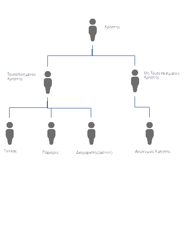

# **Ανάλυση** **Απαιτήσεων**  

## Ομάδα : :cherries: **Little** **Cherries**  :cherries:
## **Little** **Cherries** **Project** 

## **Μέλη** :

Όνοματεπώνυμο  | ΑΜ |  
-------------- | --- | 
*Τελάλη* *Ειρήνη* | 03113009 |
*Ξεζωνάκη* *Δανάη*|  03113065 |  
*Στεφανόπουλος Κοσμάς*|  03113098 | 
*Τασσοπούλου* *Βασιλική*|  03113003  | 
*Στρατή* *Φωτεινή* |  03113001| 

*******

### **Kατάλογος Περιεχομένων**

### 1. Εισαγωγή   
+ 1.1. Σκοπός του εγγράφου
+ 1.2. Δήλωση του πεδίου εφαρμογής
+ 1.3. Περιεχόμενο λογισμικού   
+ 1.4. Κύριοι περιορισμοι 
 
### 2.  Σενάρια χρήσης
+ 2.1. Κατηγορίες χρηστών    
+ 2.2. Ορισμός κλάσεων χρηστών    
+ 2.3. Διάγραμμα κλάσεων χρηστών    
+ 2.4. Περιγραφή σεναρίων χρήσης    
+ 2.5. Συγκεντρωτικά διαγράμματα σεναρίων χρήσης   
+ 2.6. Παραδοχές   
+ 2.7. Ειδικές απαιτήσεις χρήσης

### 3. Μοντέλο δεδομένων 
+ 3.1. Περιγραφή δεδομένων   
+ 3.2. Σχέσεις μεταξύ των κλάσεων     
+ 3.3. Πλήρες μοντέλο δεδομένων 

### 4. Διαγράμματα αλληλεπιδράσεων
+ 4.1. Διαγράμματα ροής πληροφορίας    
+ 4.2. Διαγράμματα Δραστηριοτήτων 

### 5. Ορισμός μη λειτουργικών απαιτήσεων 

******

##  1. Eισαγωγή 
<h> **1.1. Σκοπός του εγγράφου** </h> 
    
Σε αυτό το έγγραφο περιγράφονται και απεικονίζονται με λεπτομέρια οι Απαιτήσεις της 
    Διαδικτυακής Πλατφόρμας Εύρεσης Δραστηριοτήτων για τα παιδία. 
    Στο κείμενο, θα αναφερόμαστε σε αυτή τη Πλατφόρμα με τη συντόμογραφία  (ΕΔ).  
 

<h> **1.2. Δήλωση του πεδίου Εφαρμογής** </h> 
    
H Ηλεκτρονική Πλατφόρμα Εύρεσης Δραστηριοτήτων (ΕΔ) έχει ως βασική λειτουργία την αγορά εισιτητηρίων για κάποια εκδήλωση από κάποιον γονέα για το παιδί 
    του καθώς και την δημοσίευση εκδήλωσεων από έναν Πάροχο. Το λογισμικό θα χρησιμοποιείται αποκλειστικά από Παρόχους και Γονείς. Η ιστοσελίδα της πλατφόρμας θα είναι
    φυσικά προσβάσιμη και για τους Ανώνυμους Χρήστες χωρίς όμως αυτοί να είναι ικανοί να κάνουν οποιοδήποτε χειρισμό για δημοσίοποίηση εκδήλωσης ή για αγορά 
    εισιτηρίου.
  
   
Τα βασικά αιτήματα των χρηστών διαχωρίζονται ανάλογα με την κατηγορία αυτών. Για παράδειγμα, οι Γονείς έχουν κύριο αίτημα να μπορούν να αγοράζουν 
    εισιτήρια για οποιαδήποτε δραστηριότητα θέλουν. Από την άλλη πλευρά, οι Πάροχοι έχουν ως πρωταρχικό αίτημα να μπορούν να δημοσιοποιήσουν την εκδήλωση τους 
    ή και ακόμα να την προωθήσουν. Επιπλέον, οι Πάροχοι μπορούν όχι μόνο να δημιουργήσουν μια εκδήλωση αλλά και να ακυρώσουν μια ήδη υπάρχουσα. Και στα δύο είδη χρηστών 
    ικανοποιείται το αίτημα δημιουργίας και επεξεργασίας του προφίλ.

    
<h> **1.3. Περιεχόμενο Λογισμικού** </h>
    
 Το Λογισμικό μας χωρίζεται σε κάποια υποσυστήματα Λογισμικού που καθένα εξυπηρετεί κάποιο χαρακτηριστικό της εφαρμογής.
    Για Παράδειγμα, το ηλεκτρονικό πορτοφόλι είναι ένα υποσύστημα λογισμικού που εξυπηρετεί τις ηλεκτρονικές πληρωμές. Οι χάρτες Google που θα παρέχει η πλατφόρμα 
    μας είναι ακόμα ένα Υποσύστημα που θα στοχεύει στην καλύτερη εξυπηρέτηση των Ενδιαφερόμενων. 
 
<h> **1.4. Κύριοι Περιορισμοί** </h> 
    
 This is a paragraph 
 

## 2. Σενάρια Χρήσης

<h> **2.1. Κατηγορίες Χρηστών** </h>    
    
 Η πλατφόρμα Εύρεσης Δραστηριοτήτων για Παιδιά (ΕΔ) (Little Cheries) είναι ένα διαδικτυακό σύστημα που αναρτά υπηρεσίες δραστηριοποίησης για παιδιά.
Οι χρήστες της πλατφόρμας χωρίζονται σε δύο κατηγορίες. Η πρώτη αναφέρεται στους **Ταυτοποιημένους Χρήστες**. Στην κατηγορία αυτή υπάγονται οι **Διαχειριστές(admin)**, οι **Πάροχοι** και οι **Γονείς**. Ως Παρόχους ορίζουμε όλα εκείνα τα φυσικά πρόσωπα ή εταιρίες που διαθέτουν υπηρεσίες προς πώληση. Στη συνέχεια, οι Γονείς αφού εισέλθουν στο σύστημα, επιλέγουν και αγοράζουν τις υπηρεσίες. Η διαχείριση της πλατφόρμας επιτελείται από τους Διαχειριστές. Αυτοί είναι υπεύθυνοι για το συντονισμό, την επίβλεψη και την ομαλή διεκπεραίωση των αγορών και πληρωμών. 
 

    
 Η δεύτερη κατηγορία αναφέρεται στους **Μη Ταυτοποιημένους Χρήστες**. Περιλαμβάνει δηλαδή όλους τους χρήστες που επιθυμούν να περιηγηθούν ανώνυμα στην πλατφόρμα.
Στη συνέχεια, θα αναλύσουμε πιο λεπτομερώς τη σχέση των χρηστών με το Πληροφοριακό Σύστημα Little Cheries.

<h> **2.2. Ορισμός κλάσεων Χρηστών** </h>

   
 Όπως αναφέραμε και παραπάνω, οι χρήστες που αλληλεπιδρούν με το Πληροφοριακό Σύστημα Little Cherries είναι οι εξής:
   
* Ταυτοποιημένοι Χρήστες
    * Γονείς
    * Πάροχοι
    * Διαχειριστές(admin)
    
*  Μη Ταυτοποιημένοι Χρήστες
    * Ανώνυμοι Χρήστες

Ακολουθούν πίνακες με τους Δράστες της Πρακτικής Άσκησης που αλληλεπιδρούν με το σχεδιαζόμενο λογισμικό   

|     **Όνομα Δράστη**      | **Περιγραφή** | **Τύπος Δράστη** | **Κληρονομεί** |
|-------------------------- |:---------:    |:------------:|-----------:|
| Χρήστης | Όλοι οι δράστες που έχουν πρόσβαση στην πλατφόρμα Little Cherries | Active, Person | Ταυτοποιημένος Χρήστης, Μη Ταυτοποιημένος Χρήστης |
| Ταυτοποιημένος Χρήστης    | Είναι όλοι οι χρήστες που έχουν λογαριασμό στην Πλατφόρμα Little Cherries και μπορούν να αλληλεπιδράσουν με αυτή.  | Active, Person | Γονέας, Πάροχος, Διαχειριστής |
| Γονέας                    | Είναι οι χρήστες που μπορούν να ενημερωθούν για τις δραστηριότητες που διαφημίζονται στην πλατφόρμα Little Cherries, να τις αξιολογήσουν και να προμηθευτούν εισητήρια για αυτές μέσω της πλατφόρμας | Active, Person | Κανένας |
| Πάροχος                   | Είναι οι διοργανωτές των δρασηριοτήτων που διαφημίζονται στην πλατφόρμα. | Active, Person | Κανένας |
| Διαχειριστής (admin)      | Διαχειρίζεται την πλατφόρμα και είναι υπεύθυνος για την ομαλή αλληλεπίδραση μεταξύ Γονέων και Παρόχων. Έχουμε θεωρήσει ότι στην πλατφόρμα μας θα υπάρχει πάντα ένας βασικός Διαχειριστής, ο οποίος θα μπορεί να εξουσιοδοτήσει και άλλους Διαχειριστές   | Active, Person | Κανένας |
| Μη Ταυτοποιημένος Χρήστης | Είναι όλοι οι χρήστες που δεν έχουν κάποιο λογαριασμό στην Πλατφόρμα Little Cherries | Passive, Person | Ανώνυμος Χρήστης |
| Ανώνυμος Χρήστης          | Έχουν τη δυνατότητα να περιηγηθούν ανώνυμα στην πλατφόρμα και να ενημερωθούν για τις εκδηλώσεις που διαφημίζονται. Δεν μπορούν να αλληλεπιδράσουν περεταίρω με το Σύστημα. Για να είναι αυτό εφικτό θα πρέπει να δημιουργήσουν λογαριασμό | Passive, Person | Κανένας |

<h> **2.3. Διάγραμμα κλάσεων Δραστών** </h>
    
 Η σχέση μεταξύ των δραστών αναπαρίσταται στο παρακάτω σχήμα: 
    
    

    
<h> **2.4. Περιγραφή σεναρίων χρήσης** </h>
     
 Στην παρούσα ενότητα παρουσιάζουμε τα Σενάρια Χρήσης (Use Cases) που καταγράψαμε κατά την συλλογή των απαιτήσεων. Τα Σενάρια Χρήσης που αναλύονται παρακάτω περιγράφουν την αλληλεπίδραση των Δραστών με την πλατφόρμα Little Cherries

<h>**1. Εγγραφή Γονέα στην Πλατφόρμα** </h>
    

<h>**2. Εγγραφή Παρόχου στην Πλατφόρμα** </h>
    

<h>**3. Προσθήκη/Διαγραφή admin**</h>
    

<h>**4. Δημιουργία e-wallet από Γονέα και φόρτιση με πόντους**</h>
    

<h>**5. Επεξεργασία Προφίλ Γονέα**</h>
    

<h>**6. Επεξεργασία Προφίλ Παρόχου**</h>
    

<h>**7. Κλείδωμα Προφίλ από admin**</h>
    

<h>**8. Αλλαγή Password Ταυτοποιημένου Χρήστη**<h>
    

<h>**9. Προσθήκη event από Πάροχο**<h>
    

<h>**10. Διαγραφή event από Πάροχο**<h>
    

<h>**11. Αγορά εισητηρίου από Γονέα**<h>
    

<h>**12. Αξιολόγηση event από Γονέα**<h>
    

<h>**13. Προσθήκη ενός event στα "Αγαπημένα" ενός Γονέα**<h>
    

<h>**14. Αποθήκευση event από Γονέα**<h>
    

    

<h> **2.5. Συγκεντρωτικά διαγράμματα σεναρίων χρήσης** </h>   
    
 This is a paragraph 

    
<h> **2.6. Παραδοχές** </h> 

  
 Κατά την ανάλυση των απαιτήσεων, και μελετώντας τις ανάγκες του συστήματός μας καταλήξαμε στις εξής αρχικές παραδοχές για τους Δράστες που θα αλληλεπιδρούν με την πλατφόρμα Little Cherries: 

* Όπως αναφέραμε και παραπάνω, κατά τη δημιουργία της πλατφόρμας ορίζεται ένας αρχικός admin, ο οποίος μπορεί στη συνέχεια να ορίσει και άλλους admins.
* Όλοι οι ταυτοποιημένοι χρήστες έχουν έγκυρη διεύθυνση e-mail.
* Οι Γονείς και οι Πάροχοι έχουν έγκυρη πιστωτική κάρτα.
* Δεδομένης της απαίτησης για την ύπαρξη ηλεκτρονικού πορτοφολιού, μέσω του οποίου θα γίνεται εξαργύρωση πόντων από τους Γονείς, υποθέτουμε ότι όταν ένας Γονέας προβεί στην αγορά x πόντων, το χρηματικό υπόλοιπο στην κάρτα του θα επαρκεί για αυτή την αγορά.
* Το Σύστημά μας δεν κάνει έλεγχο για την εγκυρότητα των εκδηλώσεων, θεωρούμε δηλαδή ότι όλες οι δραστηριότητες που διαφημίζονται στην πλατφόρμα Little Cherries είναι έγκυρες και θα πραγματοποιηθούν όπως έχουν οριστεί.
* Δεν είναι δυνατόν ένας Γονέας να ακυρώσει ένα εισητήριο και να πιστωθούν ξανά στο ηλεκτρονικό πορτοφόλι του οι αντίστοιχοι πόντοι

<h> **2.7. Ειδικές απαιτήσεις χρήσης** </h>
    
 This is a paragraph 

## 3. Μοντέλο δεδομένων
<h> **3.1. Περιγραφή δεδομένων** </h>
    
 This is a paragraph 

<h> **3.2. Σχέσεις μεταξύ των κλάσεων** </h>
    
 This is a paragraph 

<h> **3.3. Πλήρες μοντέλο δεδομένων** </h>
    
 This is a paragraph 

## 4. Διαγράμματα αλληλεπιδράσεων    
<h> **4.1. Διαγράμματα ροής πληροφορίας** </h>
    
 This is a paragraph 

<h> **4.2. Διαγράμματα Δραστηριοτήτων** </h> 
    
 This is a paragraph 

##  5. Ορισμός μη λειτουργικών απαιτήσεων 

