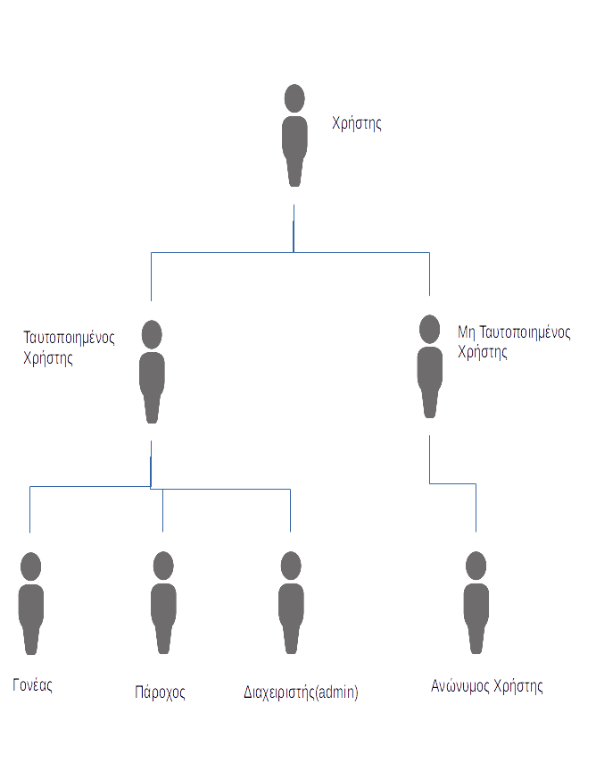

# **Ανάλυση** **Απαιτήσεων**  

## Ομάδα : :cherries: **Little** **Cherries**  :cherries:
## **Little** **Cherries** **Project** 

## **Μέλη** :

Όνοματεπώνυμο  | ΑΜ |  
-------------- | --- | 
*Τελάλη* *Ειρήνη* | 03113009 |
*Ξεζωνάκη* *Δανάη*|  03113065 |  
*Στεφανόπουλος Κοσμάς*|  03113098 | 
*Τασσοπούλου* *Βασιλική*|  03113003  | 
*Στρατή* *Φωτεινή* |  03113001| 

*******

### **Kατάλογος Περιεχομένων**

### 1. Εισαγωγή   
+ 1.1. Σκοπός του εγγράφου
+ 1.2. Δήλωση του πεδίου εφαρμογής
+ 1.3. Περιεχόμενο λογισμικού   
+ 1.4. Κύριοι περιορισμοι 
 
### 2.  Σενάρια χρήσης
+ 2.1. Κατηγορίες χρηστών    
+ 2.2. Ορισμός κλάσεων χρηστών    
+ 2.3. Διάγραμμα κλάσεων χρηστών    
+ 2.4. Περιγραφή σεναρίων χρήσης    
+ 2.5. Συγκεντρωτικά διαγράμματα σεναρίων χρήσης   
+ 2.6. Παραδοχές   
+ 2.7. Ειδικές απαιτήσεις χρήσης

### 3. Μοντέλο δεδομένων 
+ 3.1. Περιγραφή δεδομένων   
+ 3.2. Σχέσεις μεταξύ των κλάσεων     
+ 3.3. Πλήρες μοντέλο δεδομένων 

### 4. Διαγράμματα αλληλεπιδράσεων
+ 4.1. Διαγράμματα ροής πληροφορίας    
+ 4.2. Διαγράμματα Δραστηριοτήτων 

### 5. Ορισμός μη λειτουργικών απαιτήσεων 

******

##  1. Eισαγωγή 
<h> **1.1. Σκοπός του εγγράφου** </h> 
    
Σε αυτό το έγγραφο περιγράφονται και απεικονίζονται με λεπτομέρια οι Απαιτήσεις της 
    Διαδικτυακής Πλατφόρμας Εύρεσης Δραστηριοτήτων για τα παιδία. 
    Στο κείμενο, θα αναφερόμαστε σε αυτή τη Πλατφόρμα με τη συντόμογραφία  (ΕΔ).  
 

<h> **1.2. Δήλωση του πεδίου Εφαρμογής** </h> 
    
H Ηλεκτρονική Πλατφόρμα Εύρεσης Δραστηριοτήτων (ΕΔ) έχει ως βασική λειτουργία την αγορά εισιτητηρίων για κάποια εκδήλωση από κάποιον γονέα για το παιδί 
    του καθώς και την δημοσίευση εκδήλωσεων από έναν Πάροχο. Το λογισμικό θα χρησιμοποιείται αποκλειστικά από Παρόχους και Γονείς. Η ιστοσελίδα της πλατφόρμας θα είναι
    φυσικά προσβάσιμη και για τους Ανώνυμους Χρήστες χωρίς όμως αυτοί να είναι ικανοί να κάνουν οποιοδήποτε χειρισμό για δημοσίοποίηση εκδήλωσης ή για αγορά 
    εισιτηρίου.
  
   
Τα βασικά αιτήματα των χρηστών διαχωρίζονται ανάλογα με την κατηγορία αυτών. Για παράδειγμα, οι Γονείς έχουν κύριο αίτημα να μπορούν να αγοράζουν 
    εισιτήρια για οποιαδήποτε δραστηριότητα θέλουν. Από την άλλη πλευρά, οι Πάροχοι έχουν ως πρωταρχικό αίτημα να μπορούν να δημοσιοποιήσουν την εκδήλωση τους 
    ή και ακόμα να την προωθήσουν. Επιπλέον, οι Πάροχοι μπορούν όχι μόνο να δημιουργήσουν μια εκδήλωση αλλά και να ακυρώσουν μια ήδη υπάρχουσα. Και στα δύο είδη χρηστών 
    ικανοποιείται το αίτημα δημιουργίας και επεξεργασίας του προφίλ.

    
<h> **1.3. Περιεχόμενο Λογισμικού** </h>
    
 Το Λογισμικό μας χωρίζεται σε κάποια υποσυστήματα Λογισμικού που καθένα εξυπηρετεί κάποιο χαρακτηριστικό της εφαρμογής.
    Για Παράδειγμα, το ηλεκτρονικό πορτοφόλι είναι ένα υποσύστημα λογισμικού που εξυπηρετεί τις ηλεκτρονικές πληρωμές. Οι χάρτες Google που θα παρέχει η πλατφόρμα 
    μας είναι ακόμα ένα Υποσύστημα που θα στοχεύει στην καλύτερη εξυπηρέτηση των Ενδιαφερόμενων. 
 
<h> **1.4. Κύριοι Περιορισμοί** </h> 
    
 This is a paragraph 
 

## 2. Σενάρια Χρήσης

<h> **2.1. Κατηγορίες Χρηστών** </h>    
    
 Η πλατφόρμα Εύρεσης Δραστηριοτήτων για Παιδιά (ΕΔ) (Little Cheries) είναι ένα διαδικτυακό σύστημα που αναρτά υπηρεσίες δραστηριοποίησης για παιδιά.
Οι χρήστες της πλατφόρμας χωρίζονται σε δύο κατηγορίες. Η πρώτη αναφέρεται στους **Ταυτοποιημένους Χρήστες**. Στην κατηγορία αυτή υπάγονται οι **Διαχειριστές(admin)**, οι **Πάροχοι** και οι **Γονείς**. Ως Παρόχους ορίζουμε όλα εκείνα τα φυσικά πρόσωπα ή εταιρίες που διαθέτουν υπηρεσίες προς πώληση. Στη συνέχεια, οι Γονείς αφού εισέλθουν στο σύστημα, επιλέγουν και αγοράζουν τις υπηρεσίες. Η διαχείριση της πλατφόρμας επιτελείται από τους Διαχειριστές. Αυτοί είναι υπεύθυνοι για το συντονισμό, την επίβλεψη και την ομαλή διεκπεραίωση των αγορών και πληρωμών. 
 

    
 Η δεύτερη κατηγορία αναφέρεται στους **Μη Ταυτοποιημένους Χρήστες**. Περιλαμβάνει δηλαδή όλους τους χρήστες που επιθυμούν να περιηγηθούν ανώνυμα στην πλατφόρμα.
Στη συνέχεια, θα αναλύσουμε πιο λεπτομερώς τη σχέση των χρηστών με το Πληροφοριακό Σύστημα Little Cheries.

<h> **2.2. Ορισμός κλάσεων Χρηστών** </h>

   
 Όπως αναφέραμε και παραπάνω, οι χρήστες που αλληλεπιδρούν με το Πληροφοριακό Σύστημα Little Cherries είναι οι εξής:
   
* Ταυτοποιημένοι Χρήστες
    * Γονείς
    * Πάροχοι
    * Διαχειριστές(admin)
    
*  Μη Ταυτοποιημένοι Χρήστες
    * Ανώνυμοι Χρήστες

Ακολουθούν πίνακες με τους Δράστες της Πρακτικής Άσκησης που αλληλεπιδρούν με το σχεδιαζόμενο λογισμικό   

|     **Όνομα Δράστη**      | **Περιγραφή** | **Τύπος Δράστη** | **Κληρονομεί** |
|-------------------------- |:---------:    |:------------:|-----------:|
| Χρήστης | Όλοι οι δράστες που έχουν πρόσβαση στην πλατφόρμα Little Cherries | Active, Person | Ταυτοποιημένος Χρήστης, Μη Ταυτοποιημένος Χρήστης |
| Ταυτοποιημένος Χρήστης    | Είναι όλοι οι χρήστες που έχουν λογαριασμό στην Πλατφόρμα Little Cherries και μπορούν να αλληλεπιδράσουν με αυτή.  | Active, Person | Γονέας, Πάροχος, Διαχειριστής |
| Γονέας                    | Είναι οι χρήστες που μπορούν να ενημερωθούν για τις δραστηριότητες που διαφημίζονται στην πλατφόρμα Little Cherries, να τις αξιολογήσουν και να προμηθευτούν εισητήρια για αυτές μέσω της πλατφόρμας. | Active, Person | Κανένας |
| Πάροχος                   | Είναι οι διοργανωτές των δρασηριοτήτων που διαφημίζονται στην πλατφόρμα. | Active, Person | Κανένας |
| Διαχειριστής (admin)      | Διαχειρίζεται την πλατφόρμα και είναι υπεύθυνος για την ομαλή αλληλεπίδραση μεταξύ Γονέων και Παρόχων. Έχουμε θεωρήσει ότι στην πλατφόρμα μας θα υπάρχει πάντα ένας βασικός Διαχειριστής, ο οποίος θα μπορεί να εξουσιοδοτήσει και άλλους Διαχειριστές   | Active, Person | Κανένας |
| Μη Ταυτοποιημένος Χρήστης | Είναι όλοι οι χρήστες που δεν έχουν κάποιο λογαριασμό στην Πλατφόρμα Little Cherries | Passive, Person | Ανώνυμος Χρήστης |
| Ανώνυμος Χρήστης          | Έχουν τη δυνατότητα να περιηγηθούν ανώνυμα στην πλατφόρμα και να ενημερωθούν για τις εκδηλώσεις που διαφημίζονται. Δεν μπορούν να αλληλεπιδράσουν περεταίρω με το Σύστημα. Για να είναι αυτό εφικτό θα πρέπει να δημιουργήσουν λογαριασμό | Passive, Person | Κανένας |

<h> **2.3. Διάγραμμα κλάσεων Δραστών** </h>
    
 Η σχέση μεταξύ των δραστών αναπαρίσταται στο παρακάτω σχήμα: 
    
    

    
<h> **2.4. Περιγραφή σεναρίων χρήσης** </h>
     
 Στην παρούσα ενότητα παρουσιάζουμε τα Σενάρια Χρήσης (Use Cases) που καταγράψαμε κατά την συλλογή των απαιτήσεων. Τα Σενάρια Χρήσης που αναλύονται παρακάτω περιγράφουν την αλληλεπίδραση των Δραστών με την πλατφόρμα Little Cherries

<h>**1. Εγγραφή Γονέα στην Πλατφόρμα** </h>
    
**Σκοπός** του παρόντος Σεναρίου Χρήσης είναι να εγγραφεί ένας Δράστης στην πλατφόρμα Little Cherries αποκτώντας ρόλο Γονέα.   
        **Αποτέλεσμα** του Σεναρίου είναι να προστεθούν στη Βάση Δεδομένων του Συστήματος τα στοιχεία του Γονέα, ώστε να είναι δυνατόν να αλληλεπιδράσει με την πλατφόρμα όπως δηλώνεται κατά των ορισμό των Χρηστών.
        Οι **Δράστες** που συμμετέχουν στο παρόν Σενάριο είναι Χρήστες της πλατφόρμας, οι οποίοι επιθυμούν να εγγραφούν στην πλατφόρμα Little Cherries αποκτώντας ρόλο Γονέα, καθώς και οι Διαχειριστές(admins).
        
**Περιγραφή Σεναρίου:**
        
1. Ο Χρήστης που επιθυμεί να εγγραφεί ως Γονέας, επιλέγει τη λειτουργία της Εγγραφής ως Γονέας και μεταφέρεται στην αντίστοιχη σελίδα, όπου υπάρχει η κατάλλληλη φόρμα εγγραφής. .
2. Στη φόρμα αυτή ο ενδιαφερόμενος πρέπει να συμπληρώσει το Ονοματεπώνυμό του, τη διέυθυνση e-mail του, ένα τηλέφωνο επικοινωνίας, τη διεύθυνση κατοικίας του, username και password της επιλογης του.
3. Τα στοιχεία του Χρήστη προστίθενται στη Βάση και αποστέλλεται e-mail επιβεβαίωσης από την πλατφόρμα στο νέο εγγεγραμμένο πλέον Γονέα.

<h>**2. Εγγραφή Παρόχου στην Πλατφόρμα** </h>
    
**Σκοπός** του δεύτερου Σεναρίου Χρήσης είναι να εγγραφεί στην πλατφόρμα Little Cherries μια Επιχείρηση η οποία διοργανώνει παιδικές δραστηριότητες. **Αποτέλεσμα** του Σεναρίου είναι να προστεθούν στη Βάση Δεδομένων του Συστήματος, τα στοιχεία της Επιχείρησης και να δημιουργηθεί ο αντίστοιχος Λογαριασμός Παρόχου.
    Ως **Δράστη** του Σεναρίου θεωρούμε κάποιον Υπέυθυνο Επικοινωνίας της Επιχείρησης, ο οποίος μετά το τέλος του Σεναρίου θα θεωρείται από το Σύστημά μας  ως ο αντίστοιχος Πάροχος για τη συγκεκριμένη επιχείρηση.
    
**Περιγραφή Σεναρίου:**
    
1. Ο εκπρόσωπος της Επιχείρησης, επιλέγει τη λειτουργία της Εγγραφής ως Επιχείρηση και μεταφέρεται στην αντίστοιχη σελίδα, όπου υπάρχει η κατάλληλη φόρμα εγγραφής.
2. Στη φόρμα αυτή θα πρέπει να συμπληρωθούν η Επωνυμία, η διεύθυνση και το ΑΦΜ της Επιχείρησης, το Ονοματεπώνυμο, το τηλέφωνο, το e-mail του Υπεύθυνου Επικοινωνίας, καθώς και ένας αριθμός τραπεζικού λογαριασμού για τις χρηματικές συναλλαγές που θα γίνουν.
3. Επίσης, θα πρέπει να δημιουργηθεί ένα e-wallet(αρχικά άδειο) που θα περιέχει κάθε χρονική στιγμή τους πόντους του συγκεκριμένου Παρόχου.
4. Τα στοιχεία αυτά προστίθενται στη Βάση και αποστέλετται e-mail επιβεβαίωσης στον Υπεύθυνο Επικοινωνίας. 

<h>**3. Προσθήκη admin**</h>
    
**Σκοπός** αυτού του Σεναρίου Χρήσης είναι να προστεθεί από κάποιον Διαχειρσιστή της πλατφόρμας, ένας Ταυτοποιημένος Χρήστης ο οποίος θα έχει και αυτός ρόλο admin, και άρα σαν **αποτέλεσμα** θα έχει τις αρμοδιότητες και τα δικαιώματα ενός Διαχειριστή.
    Ως **Δράστη** του Σεναρίου θεωρούμε κάποιον από τους admins της πλατφόρμας και συνεπώς απαραίτητη **Προϋπόθεση** είναι να έχει εισέλθει ένας από τους τρέχοντες Διαχειριστές στον λογαριασμό του χρησιμοποιώντας έγκυρα διαπιστευτήρια.    

**Περιγραφή Σεναρίου:**

1. Ο Διαχειριστής που θα πραγματοποιήσει την εγγραφή επιλέγει τη λειτουργία της Προσθήκης νέου Admin και μεταφέρεται στην αντίστοιχη σελίδα, όπου υπάρχει η κατάλληλη φόρμα.
2. Στη φόρμα αυτή θα πρέπει να συμπληρωθούν το Ονοματεπώνυμο, η διέυθυνση, ο Αριθμός Ταυτότητας και το e-mail του νέου admin.
3. ΜΕΤΑ Ο ΝΕΟΣ ΑΝΤΜΙΝ ΠΩΣ ΑΠΟΚΤΑ USERNAME-PASSWORD ?? ΤΟΥ ΔΙΝΕΙ ΑΥΤΟΣ ΠΟΥ ΤΟΝ ΕΓΓΡΑΨΕ ΚΑΙ ΜΕΤΑ ΘΑ ΤΟ ΑΛΛΑΞΕΙ?

    
<h>**4. Δημιουργία e-wallet από Γονέα και φόρτιση με πόντους**</h>
    
 **Σκοπός** του παρόντος Σεναρίου Χρήσης είναι η δημιουργία ενός e-wallet το οποίο θα ανήκει στον ενδιαφερόμενο Χρήστη-Γονέα και η φόρτισή του με πόντους. 
    **Αποτέλεσμα** του Σεναρίου είναι να έχει ο συγκεκριμένος Χρήστης-Γονέας στη διάθεσή του ένα σύνολο πόντων, τους οποίους "αποθηκεύει" στο e-wallet που έφτιαξε και μπορελι να τους εξαργυρώσει στην αγορά εισητηρίων. 
    **Δράστες** του παρόντος Σεναρίου είναι οι Ταυτοποιημένοι Χρήστες της πλατφόρμας που έχουν το ρόλο του Γονέα και απαραίτητη **Προϋπόθεση** για τη λειτουργία του συγκεκριμένου Σεναρίου είναι να έχει εισέλθει ο Γονέας στο λογαριασμό που διατηρεί στην πλατφόρμα Little Cherries.

**Περιγραφή Σεναρίου:**

1. Ο Χρήστης-Γονέας, επιλέγει τη λειτουργία της δημιουργίας νέου e-wallet.
2. Δημιουργείται το ζητούμενο ηλεκτρονικό πορτοφόλι και ο Χρήστης έχει τη δυνατότητα να αγοράσει πόντους.
3. Επιλέγοντας τους πόντους που θέλει να αγοράσει και με βάση την Παραδοχή νο.4 που αναφέρουμε στην ενότητα 2.6, αυτοί οι πόντοι προστίθενται στο προσωπικό του e-wallet, και αφαιρείται από τον τραπεζικό λογαριασμό που έχει ορίσει ο Γονέας για αυτή τη συναλλαγή, το αντίστοιχο χρηματικό ποσό.
4. Τα χρήματα που αφαιρούνται από τον τραπεζικό λογαριασμό του Γονέα, μεταφέρονται στον τραπεζικό λογαριασμό των Διαχειριστών της πλατφόρμας.

<h>**5. Εξαργύρωση πόντων από Πάροχο**</h>
    
**Σκοπός** αυτού του Σεναρίου Χρήσης είναι η Εξαργύρωση, από έναν Πάροχο, πόντων που υπάρχουν στο ηλεκτρονικό πορτοφόλι που διατηρεί στην πλατφόρμα Little Cherries. Όπως αναφέραμε και στην ενότητα __, γίνεται μεταφορά χρημάτων από το τραπεζικό λογαριασμό των admin, στο τραπεζικό λογαριασμό του Παρόχου.
    Επομένως, **αποτέλεσμα** του Σεναρίου θα είναι να μειωθούν κατά ένα ποσό οι πόντοι στο ηλεκτρονικό πορτοφόλι του Παρόχου, καθώς και να μεταφερεί το αντίστοιχο χρηματικό ποσό από τους admins στον Πάροχο. 
    **Δράστης** του Σεναρίου είναι ο Πάροχος που εμπλέκεται στη συναλλαγή και απαραίτητη **Προϋπόθεση** είναι να έχει εισέλθει στο λογαριασμό που διατηρεί στην πλατφόρμα Little Cherries, χρησιμοποιώντας τα κατάλληλα διαπιστευτήρια.

**Περιγραφή Σεναρίου:**

1. Ο Πάροχος επιλέγει τη λειτουργία της εξαργύρωσης πόντων.
2. Επιλέγει τους πόντους που θέλει να εξαργυρώσει, οι οποίοι θα πρέπει να είναι λιγότεροι ή ίσοι από το σύνολο των πόντων που περιέχονται στο ηλεκτρονικό του πορτοφόλι.
3. Εάν ισχύει το παραπάνω, το Σύστημα μειώνει το περιεχόμενο του ηλεκτρονικού πορτοφολιού του Παρόχου και δίνει την κατάλληλη εντολή στην Τράπεζα για μεταφορά χρημάτων από τον λογαριασμό των admin σε αυτόν του Παρόχου.

<h>**6. Επεξεργασία Προφίλ Γονέα**</h>
    

<h>**7. Επεξεργασία Προφίλ Παρόχου**</h>
    

<h>**8. Κλείδωμα Προφίλ από admin**</h>
    
 **Σκοπός** αυτού του Σεναρίου Χρήσης είναι να καταστεί ανενεργό το προφίλ ενός Χρήστη, από κάποιον admin. Το **Αποτέλεσμα** του Σεναρίου θα είναι να χάσει ο συγκεκριμένος λογαριασμός τα δικαιώματα που ορίζονται από την πλατφόρμα Little Cherries και άρα να μην μπορεί να χρησιμοποιηθεί.
Οι **Δράστες** του Σεναρίου είναι οι Διαχειριστές της πλατφόρμας και απαραίτητες **Προϋποθέσεις** είναι να έχει συνδεθεί κάποιος admin στο Σύστημα χρησιμοποιώντας τα κατάλληλα διαπιστευτήρια και να έχει προηγηθεί κάποιο Σενάριο Χρήσης από τα 1,2 για το Χρήστη του οποίου ο λογαριασμός θα απενεργοποιηθεί.

**Περιγραφή Σεναρίου:**

1. Ο Διαχειριστής-Δράστης του Σεναρίου επιλέγει τη λειτουργία της Απενεργοποίησης Προφίλ Χρήστη και επιλέγει εάν ο λογαριασμός που θα απενεργοποιηθεί θα είναι Γονέα ή Παρόχου.
2. Έπειτα, επιλέγει το προφίλ που θα κλειδώσει μέσα από μια λίστα που εμφανίζεται με όλα τα προφίλ στη συγκεκριμένη κατηγορία Χρηστών
3. Τέλος, αποστέλλεται e-mail στον Χρήστη, που τον πληροφορεί για την αλλαγή στο λογαριασμό του.

<h>**9. Αλλαγή Password Ταυτοποιημένου Χρήστη**<h>
    
 **Σκοπός** του παρόντος Σεναρίου Χρήσης είναι να αλλάξει το password ενός Ταυτοποιημένου Χρήστη της πλατφόρμας Little Cherries. Το **Αποτέλεσμα** του Σεναρίου είναι να αλλάξει ο συνδυασμός username-password για τον συγκεκριμένο λογαριασμό, καθώς ο προηγούμενος κωδικός του Χρήστη ακυρώνεται.
Οι **Δράστες** που συμμετέχουν σε αυτό το Σενάριο πρέπει να έιναι Ταυτοποιημένοι Χρήστες της πλατφόρμας. 

**Περιγραφή Σεναρίου:**

1. Ο ενδιαφερόμενος Χρήστης εισέρχεται στο λογαριασμό του χρησιμοποιώντας τα κατάλληλα διαπιστευτήρια και επιλέγει τη λειτουργία της αλλαγής κωδικού πρόσβασης.
2. Ο Χρήστης πληκτρολογεί -για λόγους ασφάλειας- το e-mail του και το τρέχον password και στη συνέχεια πληκτρολογεί 2 φορές το νέο password.
3. Σε περίπτωση λάθους, το Σύστημα ζητά από το Χρήστη να πληκτρολογήσει ξανά τους κωδικούς του, μέχρι να γίνει επιτυχώς η διαδικασία.
4. Τέλος, αποστέλλεται e-mail στον Χρήστη, που τον πληροφορεί για την αλλαγή στο λογαριασμό του.

    
<h>**10. Προσθήκη event από Πάροχο**<h>
    

<h>**11. Διαγραφή event από Πάροχο**<h>
    

<h>**12. Αγορά εισητηρίου από Γονέα**<h>
    

<h>**13. Αξιολόγηση event από Γονέα**<h>
    

<h>**14. Προσθήκη ενός event στα "Αγαπημένα" ενός Γονέα**<h>
    

<h>**15. Αποθήκευση event από Γονέα**<h>
    

    

<h> **2.5. Συγκεντρωτικά διαγράμματα σεναρίων χρήσης** </h>   
    
 This is a paragraph 

    
<h> **2.6. Παραδοχές** </h> 

  
 Κατά την ανάλυση των απαιτήσεων, και μελετώντας τις ανάγκες του συστήματός μας καταλήξαμε στις εξής αρχικές παραδοχές για τους Δράστες που θα αλληλεπιδρούν με την πλατφόρμα Little Cherries: 

1. Όπως αναφέραμε και παραπάνω, κατά τη δημιουργία της πλατφόρμας ορίζεται ένας αρχικός admin, ο οποίος μπορεί στη συνέχεια να ορίσει και άλλους admins.
2. Όλοι οι ταυτοποιημένοι χρήστες έχουν έγκυρη διεύθυνση e-mail.
3. Οι Γονείς και οι Πάροχοι έχουν έγκυρο τραπεζικο λογαριασμο.
4. Δεδομένης της απαίτησης για την ύπαρξη ηλεκτρονικού πορτοφολιού, μέσω του οποίου θα γίνεται εξαργύρωση πόντων από τους Γονείς, υποθέτουμε ότι όταν ένας Γονέας προβεί στην αγορά x πόντων, το χρηματικό υπόλοιπο στην κάρτα του θα επαρκεί για αυτή την αγορά.
5. Το Σύστημά μας δεν κάνει έλεγχο για την εγκυρότητα των εκδηλώσεων, θεωρούμε δηλαδή ότι όλες οι δραστηριότητες που διαφημίζονται στην πλατφόρμα Little Cherries είναι έγκυρες και θα πραγματοποιηθούν όπως έχουν οριστεί.
6. Δεν είναι δυνατόν ένας Γονέας να ακυρώσει ένα εισητήριο και να πιστωθούν ξανά στο ηλεκτρονικό πορτοφόλι του οι αντίστοιχοι πόντοι.

<h> **2.7. Ειδικές απαιτήσεις χρήσης** </h>
    
 This is a paragraph 

## 3. Μοντέλο δεδομένων
<h> **3.1. Περιγραφή δεδομένων** </h>
    
 This is a paragraph 

<h> **3.2. Σχέσεις μεταξύ των κλάσεων** </h>
    
 This is a paragraph 

<h> **3.3. Πλήρες μοντέλο δεδομένων** </h>
    
 This is a paragraph 

## 4. Διαγράμματα αλληλεπιδράσεων    
<h> **4.1. Διαγράμματα ροής πληροφορίας** </h>
    
 This is a paragraph 

<h> **4.2. Διαγράμματα Δραστηριοτήτων** </h> 
    
 This is a paragraph 

##  5. Ορισμός μη λειτουργικών απαιτήσεων 

