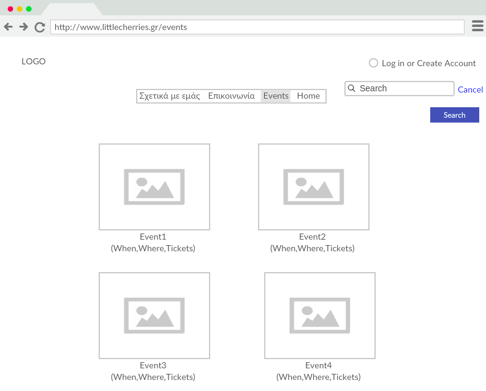
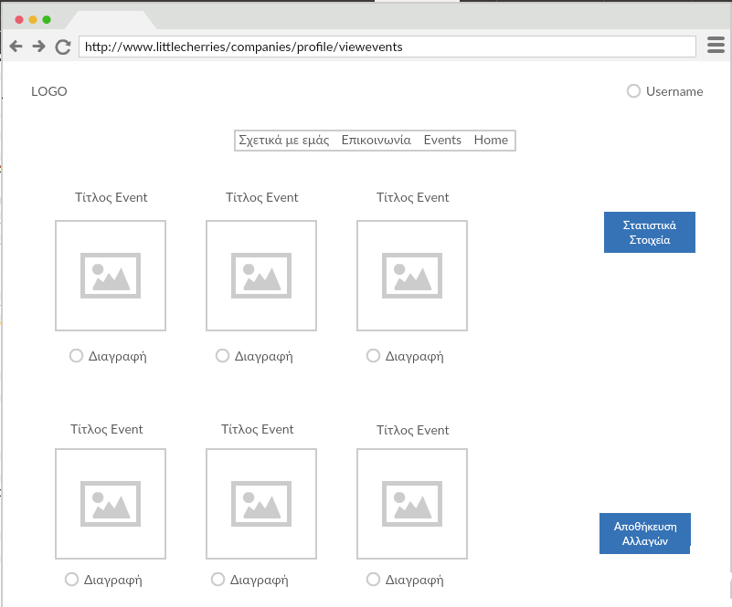
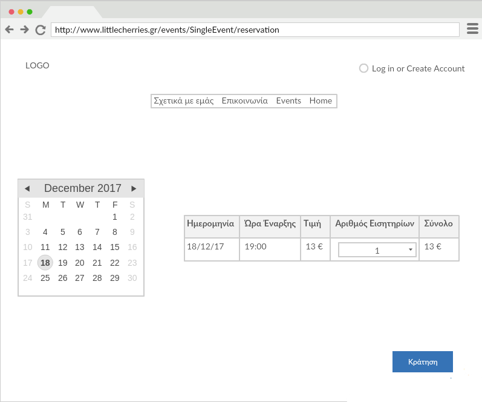

# **Τεχνικές** **Προδιαγραφές**  

## Ομάδα : :cherries: **Little** **Cherries**  :cherries:
## **Little** **Cherries** **Project** 

## **Μέλη** :

Όνοματεπώνυμο  | ΑΜ |  
-------------- | --- | 
*Τελάλη* *Ειρήνη* | 03113009 |
*Ξεζωνάκη* *Δανάη*|  03113065 |  
*Στεφανόπουλος Κοσμάς*|  03113098 | 
*Τασσοπούλου* *Βασιλική*|  03113003  | 
*Στρατή* *Φωτεινή* |  03113001| 

*******

### **Kατάλογος Περιεχομένων**

### 1. Εισαγωγή   
+ 1.1. Σκοπός του Εγγράφου
+ 1.2. Απαιτήσεις Συστήματος
    + 1.2.1. Σύνδεση με το έγγραφο Ανάλυσης Απαιτήσεων
+ 1.3. Επιχειρησιακός Στόχος

### 2. Αρχιτεκτονική Συστήματος
+ 2.1. Τεχνολογίες
+ 2.2. Εσωτερικά Υποσυστήματα
    + 2.2.1. Serves
    + 2.2.2. Σχεδιασμός Βάσης Δεδομένων
        + 2.2.2.1. Περιγραφή Βάσης
        + 2.2.2.2. E-R Διαγράμματα
    + 2.2.3. Κλάσεις
    + 2.2.4. UML Διαγράμματα Κλάσεων
+ 2.3. Το πρόσθετο Module
+ 2.4. Εξωτερικά Υποσυστήματα

### 3. Αλληλεπίδραση Συστήματος με Χρήστες
+ 3.1. Ακολουθιακά UML Διαγράμματα 
+ 3.2. Wireframes

<h> **1. Εισαγωγή** </h> 

<h> **1.1 Σκοπός του Εγγράφου** </h> 

Σκοπός του Παρόντος Εγγράφου είναι η ανάλυση των Τεχνικών Προδιαγραφών της Διαδικτυακής Πλατφόρμας εύρεσης Δραστηριοιτήτων για παιδιά, Little Cherries.

<h> **1.2 Απαιτήσεις Συστήματος** </h> 

Οι Τεχνικές Προδιαγραφές που θα αναφέρουμε, προέκυψαν έπειτα από ανάλυση των Απαιτήσεων του Συστήματος, όπως αυτές προέκυψαν από το Έγγραφο Ανάλυσης Απαιτήσεων. Για λόγους πληρότητας και συνοχής, παραθέτουμε μια περίληψη του Εγγράφου Ανάλυσης Απαιτήσεων.

<h> **1.2.1 Σύνδεση με το Έγγραφο Ανάλυσης Απαιτήσεων** </h> 
<h> **1.3 Eπιχειρησιακός Στόχος** </h> 

<h> **2. Αρχιτεκτονική Συστήματος** </h> 

<h> **2.1 Τεχνολογίες** </h> 

Για την υλοποιήση του front-end κομματιού της εφαρμογής χρησιμοποιούμε html και 
css για την δημιουργία ενός αρχικού στατικού interface ενώ στο άμεσο μέλλον θα χρησιμοποιηθεί και 
η γλώσσα javascript για την προσθήκη δυναμικού χαρακτήρα στο  interface. 
 

 Για την υλοποιήση των  διάφορων services που θα εξυπηρετεί η εφαρμογή μας χρησιμοποιείται η γλώσσα Java και το framework Springboot. Η επιλογή αυτού του framework έγινε διότι είναι αρκετά διαδεδομένο για την ευελιξία που προσφέρει στον προγραμματιστή.
Για build automation  χρησιμοποιούμε Maven που “συνδυάζεται” με το Spring Framework. 
Η ανάπτυξη κώδικα γίνεται σε περιβάλλον Eclipse. 
 

 Για την δημιουργία της βάσης δεδομένων της εφαρμογής χρησιμοποιήθηκε η γλώσσα MySQL.
Η βάση αναπτύχθηκε και “σηκώθηκε” τοπικά με τη χρήση του Xampp και του phpMyadmin. 
 

<h> **2.2 Εσωτερικά Υποσυστήματα** </h> 
<h> **2.2.1 Servers** </h> 

 Για την υλοποίηση της εφαρμογής χρειαζόμαστε ενάν web server απ’όπου θα τρέχει το site μας ενώ παράλληλα χρειαζόμαστε και έναν database server όπου θα βρίσκευται η βάση μας. 
Επιλέξαμε ως web server τον προσωπικό υπολογιστή καθενός όπου το site θα τρέχει με χρήση του Eclipse IDE. 
Ως database server θα χρησιμοποιηθεί το Xampp όπου θα έχει την βάση μας διαθέσιμη στο localhost.
Επίσης για διαχείριση της MySQL χρησιμοποιούμε σε πρώτο στάδιο και το εργαλείο phpmyadmin. 
 
<h> **2.2.2 Σχεδιασμός Βάσης Δεδομένων** </h> 
<h> **2.2.2.1 Περιγραφή Βάσης Δεδομένων** </h> 
<h> **Σχέσεις και Πεδία** </h>

 
+ Parent 
    + pemail (pk)
    + firstname
    + lastname
    + username
    + password
    + phone number
    + balance
    + last transaction date 
    + street name
    + street number
    + town 
    + postal code
    + bucketId 
+ Organizer 
    + oemail (pk)
    + company name 
    + bank account 
    + first name 
    + last name
    + username 
    + password
    + phone number 
    + balance
    + street name
    + street number
    + town 
    + postal code
    + afm 
    + registration date
    + evaluation 
+ Event 
    + eventId (pk)
    + organizer email (fk)
    + organizer name
    + event name
    + event date
    + start time
    + available tickets
    + event cost 
    + street name 
    + street number
    + town 
    + postal code
    + ages
    + event class
    + event description 
    + evaluation 
    + isdone 
+ Administrator
    + email (pk)
    + first name 
    + last name
    + username
    + password
    + phone number
    + street name
    + street number
    + town 
    + postal code
    + account
+ bucket 
    + bucketId (pk)
    + pemail (fk)
    + event cardinality
    + overal cost
+ restrictions
    + rid (pk)
    + description
+ users 
    + email (pk)
+ willAttend 
    + id (pk)
    + pemail (fk)
    + eventId (fk)
    + finaldate 
+ hasAttended 
    + id (pk)
    + pemail (fk)
    + eventId (fk)
+ ConsistsOf
    + id (pk)
    + eventId (fk)
    + bucketId (fk)
+ hasrestrictions
    + id (pk) 
    + email (fk)

 

<h> **Η χρησιμότητα των foreing keys** </h> 

 Στην ανάπτυξη της βάσης μας έγινε χρήση των foreign keys προκειμένου να επιτύχουμε αναφορική ακεραιότητα 
και συνέπεια των δεδομένων μας 
 

 Χρησιμοποιήθηκαν τα παρακάτω foreign keys:
 

 1.  Στον πίνακα event χρησιμοποιήθηκε ως foreign key to organizer email.Ο περιορισμός του foreign key επιλέχθηκε να είναι ON DELETE CASCADE έτσι ώστε άν κάποιος πάροχος διαγραφεί απο το site τότε αυτομάτως να διαγραφούν και όλα τα event που έχει διοργανώσει. 

 2.  Στον πίνακα bucket χρησιμοποιήθηκε ως foreign key to pemail.Ο περιορισμός του foreign key επιλέχθηκε να είναι ON DELETE CASCADE έτσι ώστε άν κάποιος γονέας διαγραφεί απο το site τότε αυτομάτως να διαγραφεί και το bucket του. 
 

 3.  Στον πίνακα willAttend χρησιμοποιήθηκαν ως foreign keys το pemail και το eventId.Οι περιορισμοί και στα δύο foreign keys επιλέχθηκαν να είναι ON DELETE CASCADE έτσι ώστε άν κάποιος γονέας διαγραφεί απο το site τότε αυτομάτως να διαγραφούν και οι μελλοντικές του εκδηλώσεις. Event δεν μπορεί να διαγραφεί αλλά για συνέπεια βάζουμε τον ίδιο περιορισμό και σε αυτό. 
 

 4.  Στον πίνακα hasAttended χρησιμοποιήθηκαν ως foreign keys το pemail και το eventId.Οι περιορισμοί και στα δύο foreign keys επιλέχθηκαν να είναι ON DELETE CASCADE έτσι ώστε άν κάποιος γονέας διαγραφεί απο το site τότε αυτομάτως να διαγραφούν και οι παρελθοντικές του εκδηλώσεις. Event δεν μπορεί να διαγραφεί αλλά για συνέπεια βάζουμε τον ίδιο περιορισμό και σε αυτό. 

 5.  Στον πίνακα consistsof χρησιμοποιήθηκαν ως foreign keys το bucketId και το eventId. Οι περιορισμοί και στα δύο foreign keys επιλέχθηκαν να είναι ON DELETE CASCADE έτσι ώστε άν κάποιο bucket διαγραφεί λόγω διαγραφής του γονέα, να διαγραφούν και τα περιεχόμενα αυτού.
 

 6.  Στον πίνακα hasrestrictions χρησιμοποιήθηκαν ως foreign keys το email του χρήστη και το rid. Οι περιορισμοί και στα δύο foreign keys επιλέχθηκαν να είναι ON DELETE CASCADE έτσι ώστε άν κάποιος χρήστης διαγραφεί,να διαγραφούν και τα αντιστοιχά entries περιορισμών που τον αφορούν. Οι περιορισμοί είναι καθιερωμένοι και δεν μπορούν να διαγραφούν. Παρ'αυτα χρησιμοποιούμε για συνέπεια το rid ως foreign key.
 

<h> **Επεξήγηση των views που χρησιμοποιήθηκαν**  </h> 

 Κατά την διάρκεια ανάπτυξης της βάσης μας, αναπτύχθηκαν και κάποια views ώστε να εμφανίζουμε επιλεκτικά κάποια πεδία των πινάκων στους χρήστες 
και όχι κάθε πληροφορία που περιλαμβάνεται σε αυτούς. 
 

 Υλοποιήθηκαν τα παρακάτω views : 
 
+ administrator_view
+ parent_view 
+ organizer_view 
+ restrictions_view 
+ event view 

 Αυτά τα views πρόκειται να χρησιμοποιηθούν έτσι ώστε να προσφέρουν εποπτεία στον διαχειριστή κατά τη διαχείριση του site 
 

 Σημειώνεται οτι σε πιο προχωρημένο στάδιο ανάπτυξης κώδικά είναι πιθανό είτε κάποια από τα παραπάνω να τροποποιηθούν είτε να προστεθούν περισσότερα (Triggres, Queries).

 

<h> **2.2.2.2 Διάγραμμα ER** </h>

<h> **Διάγραμμα ER της βάσης little cherries** </h> 

 

<h> **3. Αλληλεπίδραση Συστήματος με Χρήστες** </h>

<h>**3.2. Wireframes**</h>

Στη συνέχεια, παρατίθενται τα Wireframes μέσω των οποίων αλληλεπιδρούν οι Χρήστες με την πλατφόρμα Little Cherries.

<h>**Home**</h>

 

<h>**About Us**</h>

 

<h>**Contact Us**</h>

 

<h>**Events**</h>

 

<h>**Single Event Page**</h>

 

<h>**Registration**</h>

 

<h>**Add an Admin**</h>

 

<h>**Admin Login**</h>

 

<h>**Admin Profile**</h>

 

<h>**Admin Views Events**</h>

 

<h>**Admin Views Admins**</h>

 

<h>**Company Registration**</h>

 

<h>**Company Profile**</h>

 

<h>**Company Profile Edit**</h>

 

<h>**Company's Events**</h>

 

<h>**Event Creation**</h>

 

<h>**Company Views Events' Statistics**</h>

 

<h>**Parent Registration**</h>

 

<h>**Parent Profile**</h>

 

<h>**Parent Profile Edit**</h>

 

<h>**Search Events**</h>

 

<h>**Parent Loads Credits**</h>

 

<h>**Reservation**</h>

 

<h>**After Reservation Failure**</h>

 

<h>**After Reservation Success**</h>

 

 

 

